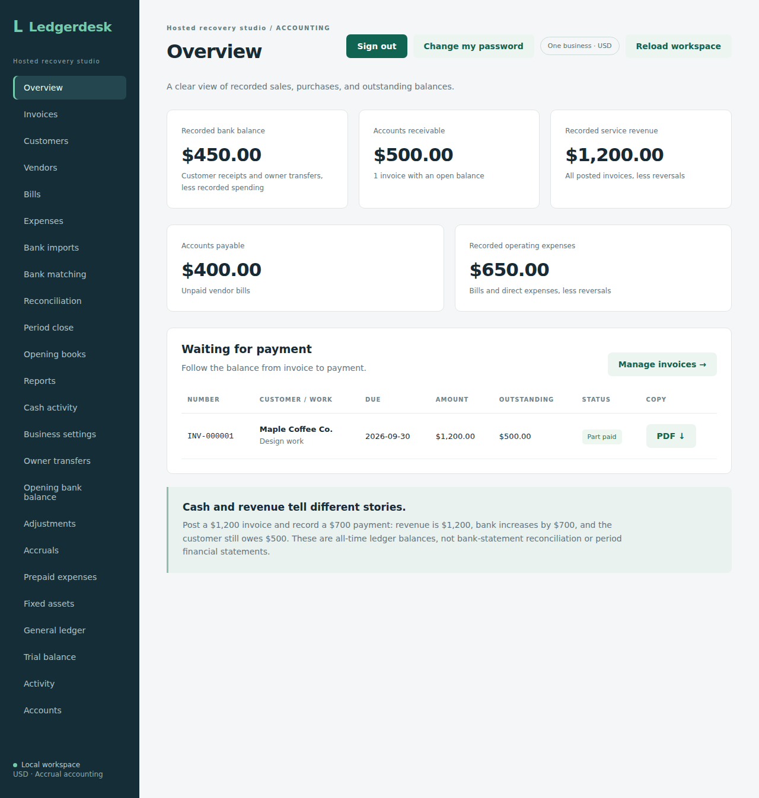

# LedgerDesk

Small business accounting software built with Java, Spring Boot, React and TypeScript.

I built LedgerDesk to connect everyday tasks like sending invoices and paying bills with the accounting behind them. It tracks cash, money owed and profit using a double-entry ledger.

## A look at the app



The screenshots use fictional data. See the [mobile view](docs/screenshots/release-mobile.png), [profit and loss report](docs/screenshots/profit-loss.png) or [sample invoice PDF](docs/invoice-example.pdf).

## What it does

- Create invoice drafts, post invoices and download PDFs.
- Track customers, vendors, bills, expenses and partial payments.
- Import bank statements from CSV, match transactions and reconcile balances.
- View profit and loss, balance sheet, cash activity and other reports.
- Handle opening balances, adjustments, assets and period closing.
- Give owners, bookkeepers and reviewers different levels of access.

It currently supports one business using USD. The app works locally; there is no public hosted demo yet.

## Built with

Java 17, Spring Boot, React, TypeScript, Vite and PostgreSQL. The local demo uses H2, so you don't need to set up PostgreSQL or Docker to try it.

## Run it locally

Install **JDK 17**, **Maven 3.9+** and **Node.js 22.12+**, then download or clone this repository.

Open two terminals in the project folder.

**Backend:**

```sh
cd backend
mvn spring-boot:run "-Dspring-boot.run.profiles=demo"
```

**Frontend:**

```sh
cd frontend
npm ci
npm run dev
```

On Windows PowerShell, use `npm.cmd` instead of `npm` if script execution is blocked.

Open **http://127.0.0.1:5173** and sign in with **`demo` / `demo-local-only`**. Keep both terminals open while using the app.

Demo entries are saved in `backend/demo-data/` between restarts. Use fictional data with this shared demo login.

## Try a simple workflow

Post a $1,200 invoice and record a $700 payment. Then add a $600 bill, pay $200 of it and record a $50 software expense.

Starting from empty books, the overview shows $450 in cash, $500 owed by the customer and $400 owed to the vendor. Revenue is $1,200 and expenses are $650, giving a $550 profit.

## More details

The longer setup notes and accounting examples are in `docs/`:

- [First setup](docs/first-use.md)
- [Financial reports](docs/reports.md)
- [HTTPS installation](docs/hosted-deployment.md)
- [Encrypted backups](docs/encrypted-backups.md)
- [Checks and verification](docs/verification.md)
