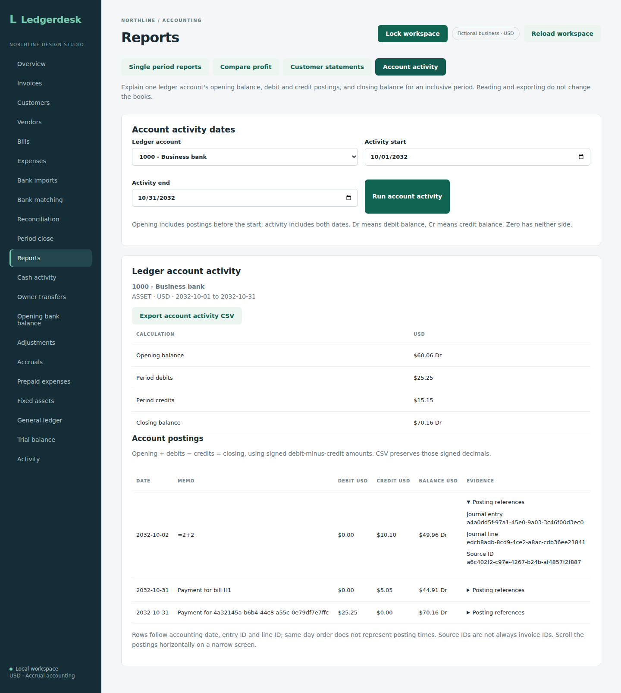

# Dated ledger account activity

Account activity explains one account's closing balance from an opening balance and the journal lines posted during an inclusive period. It works across bank, receivable, payable, revenue, expense and equity accounts rather than relying on a document's current paid/status fields. Open **Reports**, choose **Account activity**, select an account and dates, then choose **Run account activity**. Owners, bookkeepers and reviewers can use it.

## Request and response

Use the workspace login with:

```text
GET /api/reports/accounts/1000/activity?startsOn=2026-10-01&endsOn=2026-10-31
```

Owners, bookkeepers and reviewers can read it. Anonymous requests return 401. Missing/invalid dates, start after end, dates outside years 1–9999 and unknown account codes return 400. Successful responses use `Cache-Control: no-store`, USD and decimal-string monetary values. Account codes are SQL parameters, not concatenated query text.

The response contains `account` (code, current name and kind), selected dates, `openingBalance`, period `debits` and `credits`, `closingBalance` and `movements`. Each movement carries its date, memo, debit, credit, running balance and journal entry/line/source IDs. Source IDs identify the original posting source; they are not always invoice IDs. Current account names are not historical name snapshots.

## Reading the balances

Balances consistently use **debits minus credits**:

`opening + period debits - period credits = closing`

A positive number is a debit balance, a negative number is a credit balance, and zero has neither side. Thus revenue/payables normally have negative balances, while bank/receivables normally have positive balances. An unusual credit bank balance is retained, not forced positive or hidden. Activity is the ledger's actual debit/credit movement; it is not the same sign convention as the profit report's revenue and expense presentation.

For a worked bank example, an earlier payment leaves an opening $60.06 debit balance. During October, a customer payment adds a $25.25 debit; a $10.10 direct expense and $5.05 bill payment add $15.15 of credits. Bank closes at **$70.16 debit**. The ledger's dated trial-balance row must have that same debit-minus-credit amount. A later $100 expense changes the closing to **$29.84 credit**, represented by `-29.84`.

The related test books have receivables `214.99`, revenue `-300.30`, payables `-34.99` and software expense `10.10`. These are individual account balances, not a claim that the bank example alone comprises the entire trial balance.

## Cutoffs and evidence

Opening includes postings strictly before the start. Activity includes both dates. A later payment/reversal cannot change an earlier period; a new backdated posting can change a new read. Draft documents have no journal lines. An empty period still carries its earlier balance.

Rows sort by posting date, entry ID and line ID. This is a stable display order for date-only accounting, not the time transactions were entered. Each journal line appears once, including multiple lines for the same account in one entry. Running balances follow that display order. Reversal lines remain visible rather than removing the original posting.

Opening and movements share one repeatable-read transaction. Both queries restrict journal entries to business 1, and Java `BigDecimal` preserves exact cents. The chart of accounts is currently shared by the local application. This scoped read does not establish complete multi-business isolation elsewhere. It creates no journal, audit or request-key rows.

## Reproduction

Run `mvn -f backend/pom.xml -Dtest=AccountActivityTest test` against a disposable test database. Six integration tests cover the worked bank amounts and source evidence, dated trial-balance agreement across account kinds, unusual credit balances, exact split lines and stable order, future payments/reversals/invoices and drafts, foreign business entries, carried empty periods, date limits and leap day, authenticated reading roles, decimal-string responses, cache headers and invalid requests.

The existing general ledger remains available in the workspace. The dated activity screen uses the calculation above; screen and export checks are described below.


Source `5c8d3a14a59a028fc061352f484439d33776febd` passed 292 integration tests on each of H2 and PostgreSQL 17, with zero failures/errors/skips, plus 14 backup-tool tests in [run 37235848702](https://github.com/Arhaam-Azhari/ledgerdesk/actions/runs/37235848702). The production frontend build, all 25 existing Chromium workflows and native PostgreSQL restoration also passed. At that API checkpoint, browser checks were regression evidence and the account activity screen was not yet present. The six account activity tests exercise the actual service and HTTP endpoint on both databases.


## Screen and CSV

The summary shows opening balance, period debits/credits and closing balance. Balances appear as absolute dollars with **Dr** or **Cr**; zero is `$0.00` with no side. Debit and credit movement columns stay positive. This presents the server's signed amounts without changing their accounting meaning.

Each posting shows its date, memo, debit, credit and running balance. Expand **Posting references** to inspect journal entry, journal line and source IDs. On a phone, scroll the postings table horizontally; the summary stays visible above it. The page explains date/ID ordering and why a source ID is not always an invoice ID.

**Export account activity CSV** downloads the displayed account code/name/kind, selected dates, balance convention, summary amounts, postings and evidence IDs. Its filename includes the account code and both dates. Balances remain signed decimals, so revenue closing `-300.30` is exported that way even though the screen shows `$300.30 Cr`. Files use UTF-8 with a byte-order mark, quoted fields and CRLF rows. Formula-looking account/memo text is prefixed with an apostrophe; monetary fields are validated separately as decimals.

Account/date edits, workspace reloads, mode changes and failed reads clear the prior result and export button. A failed read shows an error; retry **Run account activity**. Late responses cannot restore a result after the workspace changes or the screen unmounts. Reading and exporting create no postings or audit records.

Run `npm run test:account-activity`, `npm run test:reviewer` and `npm run test:bookkeeper` in `frontend` after packaging the backend and installing Chromium. Account activity has its own fresh H2 browser process so other report fixtures cannot affect whole-account opening balances. Its fictional September–November 2032 books use the worked $70.16 bank closing, preserve October after November settlement/reversal, and show a $300.30 credit revenue balance. Tests cover posting evidence, signed CSV/context/filename, formula-looking memos, empty carried periods, invalid dates, failed-read retry, result clearing, unchanged ledger/trial balance/audit and actual horizontal scrolling at 390 pixels. Reviewer/bookkeeper workflows also run and export activity.


Screen source `89ad7b3af3fb4068a8900a5725e2dbe852a188ce` passed all three jobs in [run 37236724400](https://github.com/Arhaam-Azhari/ledgerdesk/actions/runs/37236724400): 292 integration tests on each of H2 and PostgreSQL 17 with zero failures/errors/skips, 14 backup-tool tests, production frontend build, all 26 Chromium workflows and native PostgreSQL restoration. The account activity fixture runs against its own fresh H2 process; reviewer and bookkeeper checks also run activity and export. Original desktop/mobile captures were downloaded and visually reviewed. The summary fits the 390-pixel screen, and the postings table was actually scrolled to its evidence column.


## Screen evidence

The fictional October 2032 bank activity opens at $60.06 Dr, adds $25.25 in debits and $15.15 in credits, and closes at $70.16 Dr despite November settlement/reversal. The desktop capture expands the $10.10 expense's source evidence. The deliberately formula-looking memo also exercises safe CSV text handling. The mobile capture shows summary values above the horizontally scrolled evidence column.



[Mobile account activity summary and scrolled posting references](screenshots/mobile-account-activity.png)
