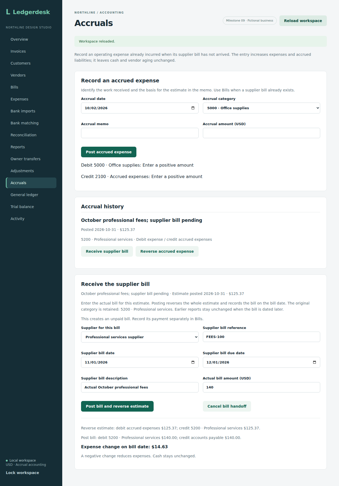
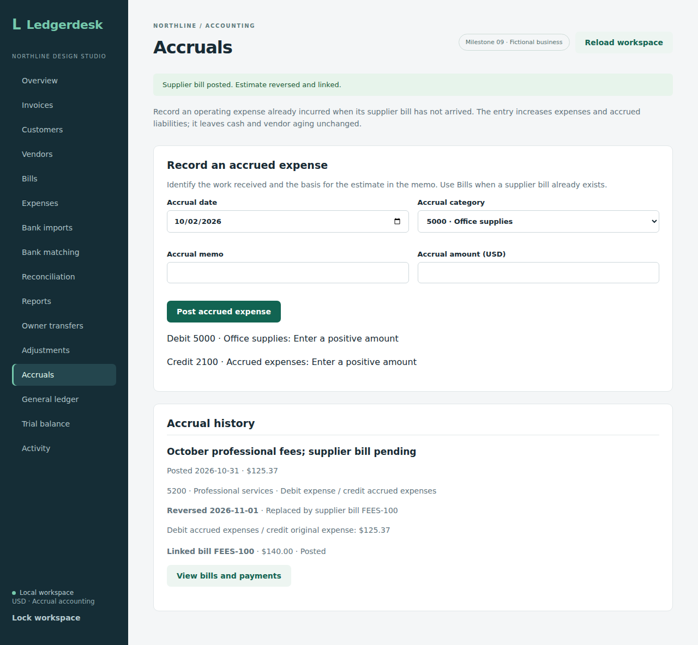
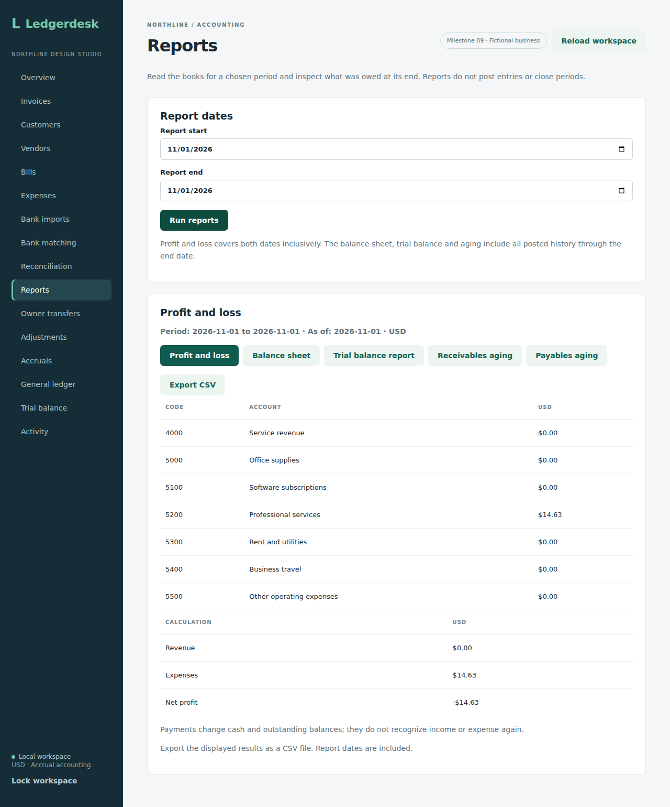
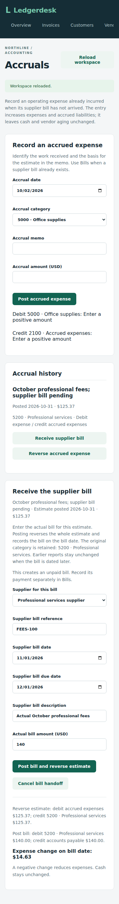

# Replacing an accrual with its supplier bill

This workflow receives an actual supplier bill against one unreversed accrued-expense estimate. It reverses the entire estimate and posts the actual bill on the same date, using the original expense category. Both records and their link are retained. It does not record a payment.

## Accounting example

An October 31 estimate of $125.37 debits Professional services (5200) and credits Accrued expenses (2100). On November 1, the supplier sends a $140 bill. The handoff posts:

| Posting | Debit | Credit |
| --- | --- | --- |
| Reverse estimate | Accrued expenses $125.37 | Professional services $125.37 |
| Actual bill | Professional services $140.00 | Accounts payable $140.00 |

October keeps its $125.37 expense and liability. November records $14.63 of additional expense; cumulative expense becomes $140. The accrued liability is cleared and vendor aging shows the actual $140 bill. Cash stays unchanged. If the actual bill is $100, November instead records a $25.37 expense reduction. Equal amounts produce no additional expense in November.

## Using the screen

1. Add the supplier in **Vendors** if it is not already recorded.
2. In **Accruals**, find the unreversed estimate and choose **Receive supplier bill**.
3. Enter the supplier, actual reference, bill date, due date, description and amount. The estimate's category stays fixed.
4. Review the two postings and the expense change on the bill date. For the example above, it is $14.63.
5. Choose **Post bill and reverse estimate**. History retains the estimate, dated reversal and linked bill reference, amount and status.
6. Use **View bills and payments** to open Bills and find the reference. Record a payment there when money is actually paid.

An interrupted refresh keeps the handoff form and its request key. Retry with the same details to retrieve the existing bill. Reloading the workspace also preserves an open handoff draft. An estimate that was already reversed does not offer another handoff. Voided linked bills remain visible with a note to review the obligation.

## API

`POST /api/accruals/{id}/bill` accepts:

```json
{"vendorId":"existing-vendor-id","reference":"FEES-100","description":"Actual October professional fees","issuedOn":"2026-11-01","dueOn":"2026-12-01","amount":"140.00"}
```

Use authentication, a CSRF token and an `Idempotency-Key`. The returned `id` is the newly posted bill. Workspace `accruals` includes `bill_id`, `bill_reference`, `bill_amount` and `bill_status`, alongside the original estimate and reversal metadata. A linked bill uses the normal Bills payment, receipt and voiding workflows.

The bill date must be open and on or after the estimate date. The original period may remain closed. The due date must be on or after the bill date. Vendor, reference, description and positive amount follow the existing bill rules, including duplicate references for that vendor. The original expense category is used automatically. An accrual already reversed manually cannot be received through this endpoint; enter its bill separately after reviewing its accounting history. Unknown accruals and inconsistent original journals are rejected.

## Why one command

The reversal, bill, link, request record and activity event commit together. If any validation, database write or activity write fails, all of them roll back. The operation shares the business lock with normal posting and reversals, so competing requests cannot both consume one estimate. Unique database links also enforce one bill per accrual. An exact retry returns the existing bill, including after its period closes; changing details under the same key is rejected.

Ordinary bill posting and the handoff share the same bill creation routine. That keeps category, vendor, reference and journal rules consistent without creating nested request keys. The handoff has one command and one combined activity event, `ACCRUAL_BILL_POSTED`.

Voiding an unpaid linked bill retains its link and the estimate reversal. It does not automatically restore the estimate. A paid bill cannot be voided under the existing purchase rules. Review the remaining obligation before recording a replacement; historical reports retain every dated entry.

## Checks and scope

Twelve new integration tests cover equal/larger/smaller bills, exact retries, closed and historical dates, rollback after invalid bill details and duplicate references, manually reversed or inconsistent originals, activity failure, normal payments and voiding, endpoint security and two competing submissions. Run `mvn test` from `backend`; CI runs the full suite on H2 and PostgreSQL 17. Source checkpoint `4dde31f8a61e0e052caa6154e64c8a26b92c9ef2` passed all 155 integration tests on each of H2 and PostgreSQL 17, with zero failures, errors or skips, the production frontend build and all thirteen existing Chromium workflows in [CI run 36952050080](https://github.com/Arhaam-Azhari/ledgerdesk/actions/runs/36952050080). That checkpoint verified the handoff API before the form was added.

The feature includes the API, handoff form, linked history and browser coverage. It replaces one entire estimate with one actual bill. Partial or multiple bills, attaching an already posted bill, and automatic scheduled reversals are future work.


## Browser verification and screenshots

Source `c62e9983f41b4db753409bde96e23a10bcefba26` passed **155 integration tests on each database**, the production frontend build and all **fourteen Chromium workflows** in [run 36953376746](https://github.com/Arhaam-Azhari/ledgerdesk/actions/runs/36953376746). The isolated handoff workflow verifies missing-vendor guidance, zero/precision rejection, a closed bill date without partial reversal, an open handoff from a closed original period, draft retention after reload, an interrupted-refresh retry producing one linked bill, historical reports, the $14.63 difference, normal partial payment, retained void status and mobile layout. Four captures from that run were downloaded and visually reviewed. The form capture waits for the workspace to be ready.

From the project folder:

```sh
cd backend
mvn package -DskipTests
cd ../frontend
npm ci
npx playwright install chromium
npm run test:handoff
```

The isolated workflow uses backend port 8086 and frontend port 5179 with an in-memory demo. Keep both ports free. Captures are written to `frontend/handoff-results/` and uploaded by CI.

### Actual bill preview



### Linked history



### Expense difference



### Mobile form


