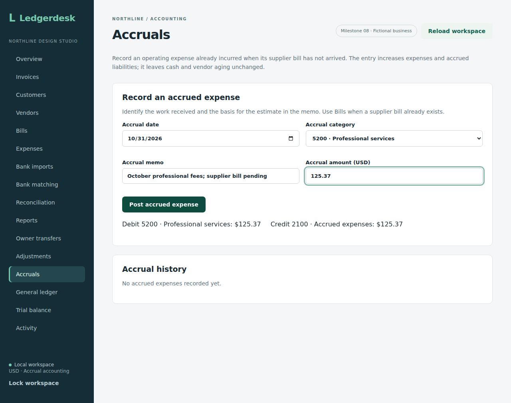
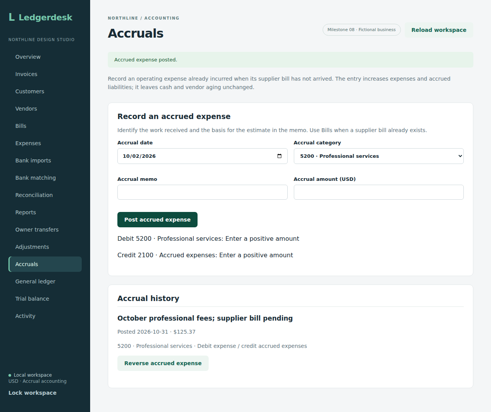
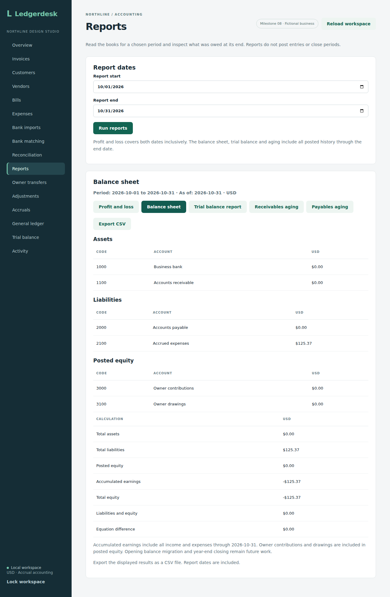
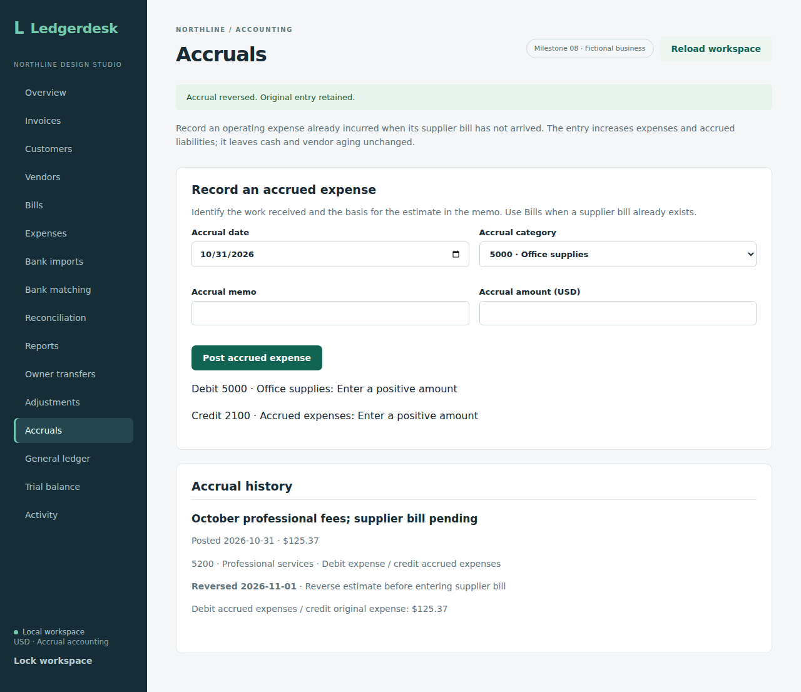
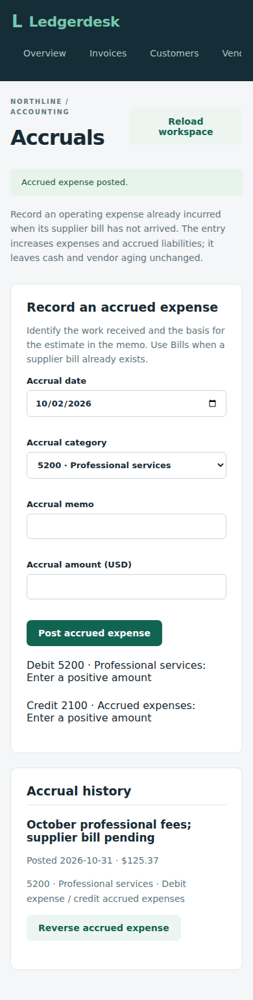

# Accrued expenses

This workflow records an operating expense that has been incurred but has no supplier bill yet. A month-end estimate for professional fees debits Professional services (5200) and credits Accrued expenses (2100). Cash and vendor aging stay unchanged. The liability appears separately on the balance sheet.

## Example

On October 31, record $125.37 for work already received. October expenses increase by $125.37, accumulated earnings fall by the same amount, and accrued liabilities increase by $125.37. The trial balance and balance sheet still balance.

A November 1 reversal debits accrued expenses and credits the original expense category. October reports retain the estimate; November shows its offset. The reversal can be in an open period even when October is closed. Entering the eventual supplier bill remains a separate step. Until a linked bill handoff is added, review the estimate and reversal together to avoid counting the expense twice. A reversal does not mark the supplier as paid or automatically create a bill.

## Using the screen

1. Open **Accruals** in the local demo.
2. Enter date `2026-10-31`, category **5200 · Professional services**, memo `October professional fees; supplier bill pending`, and amount `125.37`.
3. Inspect the preview: both the expense debit and accrued-liability credit are $125.37. Post the accrued expense.
4. Run **Reports** for October 1–31. Expenses are $125.37 and the balance sheet shows the accrued liability, assuming an otherwise empty ledger. Vendor aging is still zero.
5. In **Accruals**, choose **Reverse accrued expense**. Enter November 1 and a reason, then confirm. Both dated records remain visible. October reports stay unchanged; November shows the offset.

If a refresh fails after posting or reversing, retry with the same form details. The screen retains those details and the request key until the command and refresh both succeed. Reloading the workspace shows the retained history.

## API

`POST /api/accruals` accepts:

```json
{"postedOn":"2026-10-31","memo":"October professional fees; supplier bill pending","accountCode":"5200","amount":"125.37"}
```

`POST /api/accruals/{id}/reverse` accepts:

```json
{"reversedOn":"2026-11-01","reason":"Reverse estimate before entering supplier bill"}
```

Both routes require authentication, a CSRF token and an `Idempotency-Key`. Each response returns an ID. Keep the request key when retrying an uncertain response; an exact retry returns the original ID. Reusing a key for different details is rejected. Workspace state exposes `accruals`, with original details and reversal metadata. The journal retains both dated entries.

Dates must have a year between 1 and 9999; memo/reason must be nonblank and at most 240 characters. Amounts must be positive, with at most two decimal places and twelve integer digits. Only operating expense categories are accepted. New postings and reversal dates cannot enter closed periods. A reversal cannot precede its original accrual or be repeated with a new key. An inconsistent original journal requires review. Header, journal, request key and activity are written in one transaction.

## Checks and screenshots

Source checkpoint `fa49a0586143e8c6b015e5b79638ab00b4b820d0` passed all **143 integration tests on each of H2 and PostgreSQL 17**, the production frontend build and all **thirteen Chromium workflows** in [CI run 36950384165](https://github.com/Arhaam-Azhari/ledgerdesk/actions/runs/36950384165). There were no failed, errored or skipped backend tests. The ten accrual integration tests cover exact reports, cutoff history, closed periods, retries, input validation, transaction rollback, inconsistent journals and endpoint security.

The isolated browser workflow exercises positive-amount and precision validation, posting and reversal after interrupted refreshes, retained history, closed-date rejection, an October report preserved by a November reversal, zero cash/vendor aging impact, reloading and a 390-pixel mobile layout. The five captures below were downloaded from that successful run and visually reviewed.

Run `mvn test` from `backend`; PostgreSQL reproduction settings are in the main README. To reproduce the browser workflow:

```sh
cd backend
mvn package -DskipTests
cd ../frontend
npm ci
npx playwright install chromium
npm run test:accruals
```

The browser configuration starts an isolated in-memory demo on backend port 8085 and frontend port 5178. Keep both ports free. Captures are written to `frontend/accrual-results/` and uploaded by CI.

### Entry preview



### Retained history



### Balance sheet proof



### Later reversal



### Mobile



## Remaining work

Linked bill handoff, partial settlement and scheduled reversals remain future work. Prepaid expenses and depreciation require separate workflows. The current feature records one expense estimate and one full dated reversal; it does not automate settlement.
