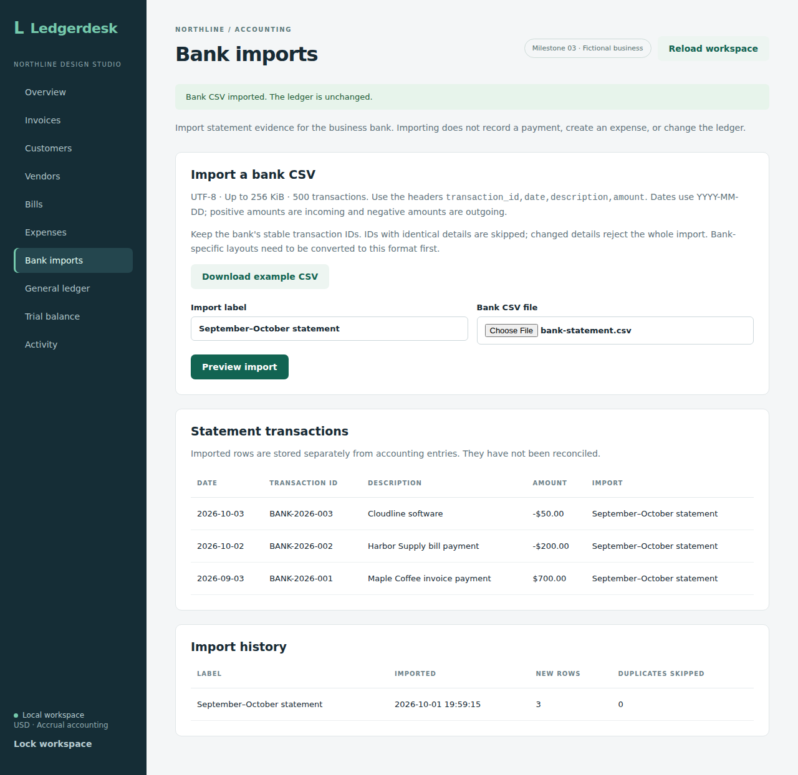

# Bank import sprint

This development branch adds CSV preview and import in the browser and backend. Matching and statement reconciliation are the next steps. Importing statement rows does not post accounting entries or change the recorded bank balance.

## Accepted format

Use UTF-8 CSV with these headers in this order:

```csv
transaction_id,date,description,amount
BANK-2026-001,2026-09-03,Maple Coffee invoice payment,700.00
BANK-2026-002,2026-10-02,Harbor Supply bill payment,-200.00
```

Positive amounts are incoming; negative amounts are outgoing. Dates use `YYYY-MM-DD`, and amounts use plain decimal notation with at most two decimal places. Files are limited to 256 KiB and 500 transactions. The parser handles quoted commas, escaped quotes, CRLF/LF line endings, and a UTF-8 byte-order mark. IDs and descriptions must be single-line text without control characters.

Supply a stable transaction ID from the bank export. IDs are case-sensitive after trimming spaces. A new ID remains a separate transaction even when its date, description, and amount equal another row. Reusing an existing ID with identical details skips that row; changed details reject the entire batch. Duplicate IDs within one CSV are rejected. Arbitrary bank-specific column layouts and exports without stable IDs are not supported yet.

The current account is the one business bank ledger account, `1000`, in USD. There is no live bank connection. A [fictional example](examples/bank-statement.csv) corresponds to the README walkthrough.

## API

`POST /api/bank/imports/preview` accepts JSON with `label` and `csv`, validates every row, and returns the row details and duplicate flags without saving anything. Preview requires authentication and CSRF like other POST endpoints.

`POST /api/bank/imports` accepts the same JSON plus an `Idempotency-Key`. It rechecks duplicates under the business write lock, then commits the import summary, new statement rows, request result, and activity event together. A failed write rolls them all back. `/api/state` returns `bankImports` and `bankTransactions` alongside the existing workspace data.

The backend checks cover parsing, signed amounts, duplicate and overlapping exports, conflicting IDs, retries, concurrent imports, transaction rollback, and API authentication/CSRF. All 58 backend integration tests passed on H2 and all 58 passed on PostgreSQL 17, with zero failures, errors, or skipped tests in [run 36917162259](https://github.com/Arhaam-Azhari/ledgerdesk/actions/runs/36917162259). This includes the 13 bank-import tests and the 45 existing tests. Verified source commit: `bc4dff92965a898377fbb295a0411f3b0e67c6c1`. Browser import testing will be added with the interface.

## Browser workflow

Open **Bank imports**, download the fictional example or select a UTF-8 `.csv`, and enter an import label. **Preview import** validates the complete file and shows which rows are new and which will be skipped. **Confirm import** saves the validated request and refreshes the statement transactions and import history. Changing the selected file or label clears the preview. Invalid UTF-8 is rejected before sending the file to the backend.

The browser check covers example download, preview without saving, import without changing the ledger, overlapping rows, a changed-ID rejection, broken UTF-8, and use at a 390-pixel width. All seven Chromium workflows and the frontend production build passed in [run 36918096871](https://github.com/Arhaam-Azhari/ledgerdesk/actions/runs/36918096871), source commit `d832b2059b28b03edf3b5560afdbc052bd76be4c`. All 58 backend tests also passed on both databases in that run. The desktop and mobile captures were downloaded and visually inspected.


