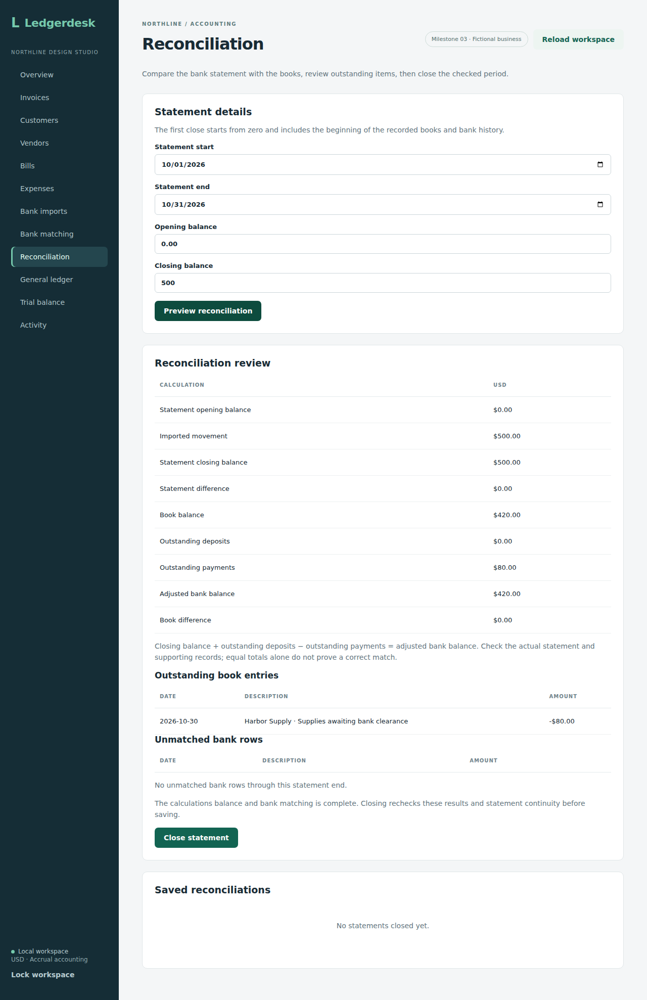
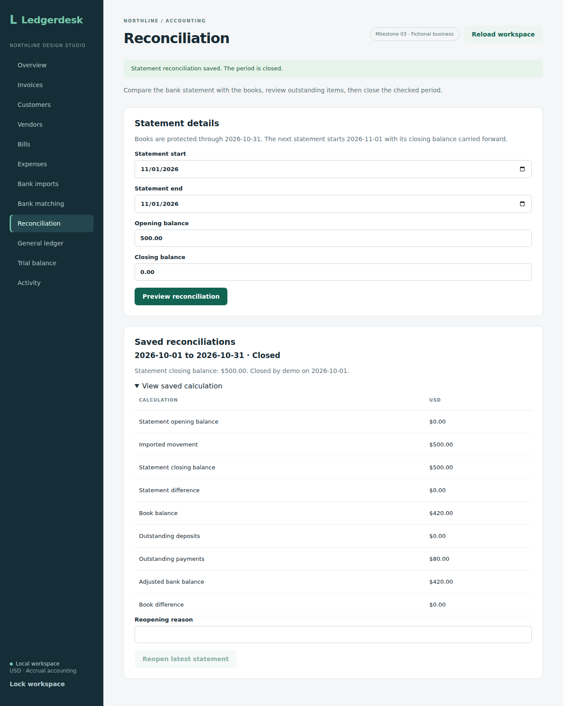

# Statement reconciliation

The backend compares an imported statement with the bank ledger as of a chosen end date. Preview is read-only. Closing saves the checked calculation and protects the period; reopening retains that snapshot and records a reason. The browser screen supports preview, closing, saved calculations, and reopening the latest closed statement.

## What the numbers mean

Enter the statement's inclusive start and end dates, opening balance, and closing balance. Balances may be zero or negative and must use plain decimal notation with at most two decimal places. The current scope is the single business's USD bank account, `1000`.

| Result | Calculation |
| --- | --- |
| Imported movement | Sum of statement rows dated within the period |
| Statement difference | Closing balance minus opening balance minus imported movement |
| Book balance | Sum of all bank journal debits minus credits through the end date |
| Outstanding deposits | Positive book entries through the end date that have not cleared by then |
| Outstanding payments | Absolute value of negative book entries through the end date that have not cleared by then |
| Adjusted bank balance | Closing balance plus outstanding deposits minus outstanding payments |
| Book difference | Adjusted bank balance minus book balance |

For example, a statement closing at $500 with a $125 deposit and an $80 payment still outstanding should explain a book balance of $545. A zero statement difference checks that the imported movement agrees with the entered balances. A zero book difference checks the second calculation. Neither alone proves that the statement is complete or that every association is correct; the user must review the actual bank statement and supporting records.

A book payment matched to a bank row dated next month remains outstanding for this month. Conversely, a bank row matched to a book entry dated after this statement ends is returned in `futureDatedMatches` for correction. Unmatched bank rows through the end date are returned even when they precede the selected start, so moving the start forward cannot hide unfinished matching.

The book calculation includes every bank journal line, including corrections and reversals. Offsetting entries may therefore appear on both sides of the outstanding list and require review. The current matcher supports posted customer payments, bill payments, and direct expenses; it does not support matching reversal lines. The preview makes that limitation visible rather than omitting those lines from the balance.

## API

`POST /api/bank/reconciliations/preview` requires authentication and CSRF. It does not require an idempotency key because it saves nothing.

```json
{
  "startsOn": "2026-10-01",
  "endsOn": "2026-10-31",
  "openingBalance": "0.00",
  "closingBalance": "500.00"
}
```

As elsewhere in the API, amounts are returned as decimal strings. The response includes the amounts in the table plus `unmatchedTransactions`, `outstandingEntries`, and `futureDatedMatches`. Reads use one repeatable-read transaction so concurrent imports or matching cannot mix different workspace versions within a response.

Opening and closing balances are supplied by the user. A preview may cover any valid date range, but a zero difference is not a closed-period status. Closing applies the additional rules below.

## Closing and reopening

`POST /api/bank/reconciliations` accepts the same statement JSON plus an `Idempotency-Key`. It recalculates under the business write lock, rather than trusting a preview from an earlier moment. Both differences must be zero, with no unmatched statement rows through the end date and no matches to future-dated book entries. Outstanding book entries are allowed when they explain the balance.

The first close must have a zero opening balance and start on or before the earliest recorded journal entry and imported bank row. This project does not yet migrate a business's existing opening balances. Later statements start the day after the latest closed statement and carry forward its closing balance. Gaps and overlaps are rejected.

Each close saves dates, balances, the full preview snapshot, the owner, and the time. `/api/state` includes `bankReconciliations`. A closed period rejects all new journal postings dated through its end, not just bank postings. That covers invoices, posted drafts, bills, payments, expenses, and dated reversals. A rejected posting rolls back its document changes too.

New bank rows dated through the closed end cannot be imported; a mixed batch rolls back completely. Identical existing rows can still be skipped as duplicates. Matches on closed bank rows cannot be added or removed. A payment recorded in the old period may still be matched to a bank row clearing after that period: it remains outstanding in the earlier snapshot. Correcting a direct expense originally dated in a closed period requires reopening it first, even if the correction date is later.

`POST /api/bank/reconciliations/{id}/reopen` accepts `version` and `reason`, plus an `Idempotency-Key`. Only the latest currently closed statement can be reopened. A later statement must be reopened before an earlier one. The snapshot remains unchanged; status, version, reopening owner, time, and reason are retained, along with an activity event. A replacement close creates a new record so the original remains available. A stale reopening request cannot reopen that replacement.

Closing and reopening require authentication and CSRF. Retries return the original request result without duplicating records or events. The same business lock serializes closing with imports, matching, reopening, and posting. Customer/vendor creation, unposted draft editing, and receipt attachment remain available because they do not alter posted balances or bank associations.

## Checks

Eight integration tests cover cleared and outstanding items, missing statement movement, unrecorded charges, transactions clearing next month, future-dated book matches, period boundaries, older unmatched rows, reversals, input validation, and endpoint authentication/CSRF. They also check that preview leaves journal lines and request records unchanged. All 76 backend integration tests passed on H2 and all 76 passed on PostgreSQL 17 with zero failures, errors, or skipped tests in [run 36923012651](https://github.com/Arhaam-Azhari/ledgerdesk/actions/runs/36923012651), source commit `a79e45e0986654198b60d7d5131a9708b84e41e2`. This includes the eight new reconciliation tests and the 68 existing tests.


The close/reopen sprint adds ten more integration tests for saved snapshots, retries, opening continuity, gaps/overlaps, reopening order, stale requests, posting/payment rollback, closed-period imports and matches, later clearing, write rollback, endpoint security, and a competing close/import. All 86 tests passed on H2 and all 86 passed on PostgreSQL 17 with zero failures, errors, or skipped tests in [run 36925530887](https://github.com/Arhaam-Azhari/ledgerdesk/actions/runs/36925530887), source commit `61e65541c0b97aad9b5256585fc07286da88adb8`. The frontend production build and all eight existing Chromium workflows also passed. That checkpoint covers the existing invoice, purchase, import, and matching screens. The later browser checkpoint below adds the isolated reconciliation workflow.


## Browser workflow

Open **Reconciliation** after recording the books, importing the statement, and reviewing bank matches. The form starts with the earliest recorded date for a first statement, or the next day and carried balance after a closed statement. Enter the dates and balances from the actual statement, then choose **Preview reconciliation**. Editing a field clears the old preview.

Review both differences and the outstanding book entries. The screen also lists unmatched bank rows and warns about matches to future-dated book entries. **Close statement** is enabled only when the preview balances and matching is complete. Closing requires confirmation and rechecks statement continuity and the current books on the server. A failed refresh can be retried without creating a second saved reconciliation.

**Saved reconciliations** shows period dates, status, the closing balance, and who closed it. Expand **View saved calculation** to see the preserved numbers. The latest closed statement has a reopening form: enter a reason and confirm **Reopen latest statement**. The original snapshot remains in history with the reopening reason. Older periods must be reopened in reverse order.

### Run the browser check

Build the backend JAR with `mvn -f backend/pom.xml package -DskipTests`. Then run `npm ci` in `frontend`, install Chromium with `npx playwright install chromium`, and run `npm run test:reconciliation`. This starts a separate demo backend on port 8081 with an in-memory database and a frontend on port 5174; both stop when the test finishes. Keep these two ports free. The existing invoice/purchase/import/matching tests use the normal demo backend and `npm run test:e2e`.

The isolated workflow prepares a fictional $500 customer payment and an $80 expense awaiting bank clearance, checks an incorrect closing balance, clears an obsolete preview after editing, previews the balanced statement, cancels and confirms closing, retries after an interrupted refresh, checks saved history and unchanged journal balances, attempts a protected match change, reopens with a reason, compares snapshots, and checks a 390-pixel layout. All nine Chromium workflows (eight existing plus the isolated reconciliation check), the frontend production build, and all 86 backend tests on each database passed in [run 36928181272](https://github.com/Arhaam-Azhari/ledgerdesk/actions/runs/36928181272), source commit `76558dc5be2f1cab430665ad31ae51aca1314780`. The desktop review, saved close, and mobile reopening captures were downloaded and visually inspected.






[Mobile reopening view](screenshots/mobile-reconciliation.png)
