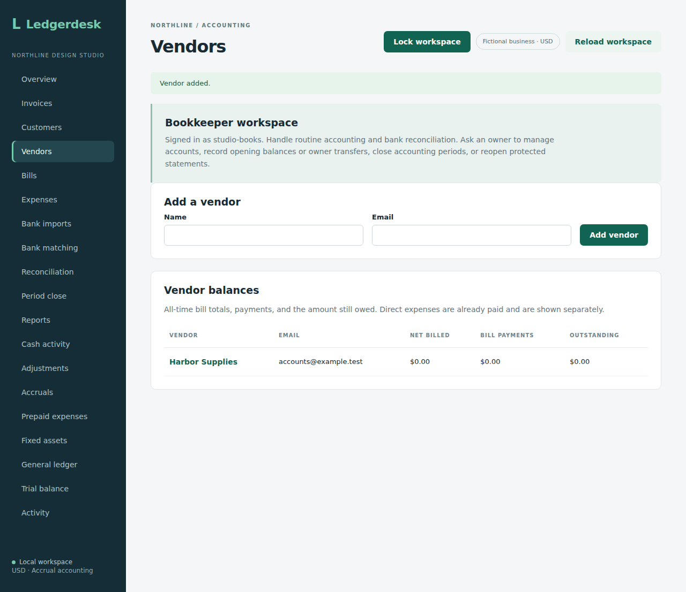

# Bookkeeper access

A service business may delegate daily accounting while keeping access administration and closed-period decisions with its owner. Stored accounts now support a BOOKKEEPER role alongside OWNER and REVIEWER. Enable persistent account mode, sign in as an owner, open **Accounts** and choose **Bookkeeper · routine accounting** when creating an account. An owner can also change an existing account's role.

| Operation | Owner | Bookkeeper | Reviewer |
| --- | --- | --- | --- |
| Read reports, ledger, receipt downloads and period history | Yes | Yes | Yes |
| Documents, payments, receipts and retained corrections | Yes | Yes | No |
| Expense adjustments, accruals, prepaid schedules and assets | Yes | Yes | No |
| Bank import, matching and statement reconciliation | Yes | Yes | No |
| Opening balance and owner transfers | Yes | No | No |
| Accounting close/reopen and statement reopening | Yes | No | No |
| Account list, creation, role changes and password reset | Yes | No | No |

Bookkeepers see an explanation of their limits. Owner-only navigation is absent, accounting period history remains readable and statement history has no reopening form. Owners must reopen a protected statement or accounting period before a bookkeeper can correct its books. An owner's final accounting close is a separate review from routine statement reconciliation.

The server delegates only an explicit list of POST routes. Unknown routes and other write methods stay owner-only. All writes still require CSRF, and existing validation, closed-date guards, balanced postings, activity and request retries apply. A changed role or disabled account affects the next authenticated request. A bookkeeper cannot use account administration to promote themselves, and last-owner protection remains in force.

Migration V22 preserves user IDs, password hashes and existing memberships while expanding the membership role constraint. Bookkeepers are created through persistent account administration; configured-login mode retains its existing owner/reviewer setup. This remains a single-business local application, with no approval queue or hosted sessions. Bookkeepers can inspect all accounting information for the business; this role is unsuitable when individual documents must be confidential from staff.

## Verification

The production frontend build and diff checks pass locally. Seven new integration tests cover stored-role identity, routine posting with an exact retry and activity actor, CSRF, owner-only actions, unknown routes/methods, module validation, disabling/demotion and last-owner/role constraints. The new Chromium workflow signs in with a real stored bookkeeper, posts a vendor, checks absent owner controls, exercises direct forbidden API calls and captures desktop/mobile views. Run `npm run test:bookkeeper` from `frontend` after packaging the backend and installing Chromium; ports 8096 and 5188 must be free.

Source `eaf47a5a11ffa572974cd99271de68aa2573d39f` passed [run 37182387234](https://github.com/Arhaam-Azhari/ledgerdesk/actions/runs/37182387234): 260 integration tests on each of H2 and PostgreSQL 17, no failures/errors/skips, 14 backup-tool tests, production build, all 23 Chromium workflows and the existing PostgreSQL restore scenario. The two original captures were downloaded and visually reviewed for readable text, appropriate controls and mobile page width. 

[Desktop vendor posting](screenshots/bookkeeper-vendor.png) and [mobile period review](screenshots/bookkeeper-mobile.png) show fictional data from that workflow.

This demonstrates delegated access at the API boundary with permission-aware screens. Bookkeeper-specific backup restoration and existing-database migration fixtures remain further verification work.
