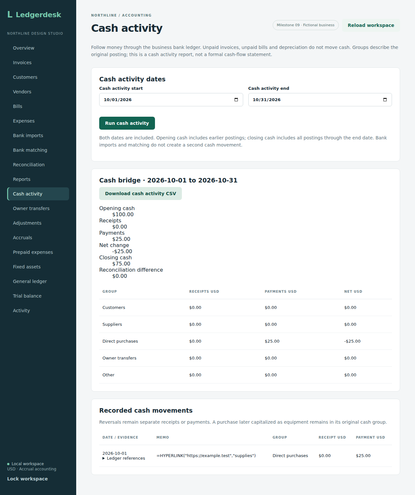
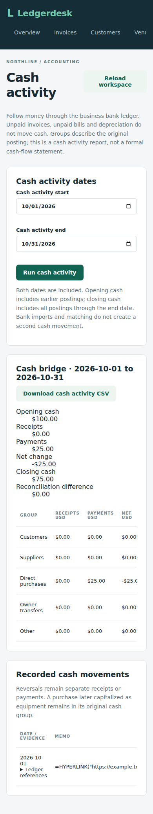

# Cash activity

This checkpoint adds `GET /api/reports/cash-activity?startsOn=2026-10-01&endsOn=2026-10-31`, an authenticated read-only ledger report for the single local business. Dates are inclusive. Opening cash includes entries strictly before the start; closing cash includes entries through the end. Receipts and payments retain gross amounts, including corrections, so opening plus receipts less payments equals closing cash. A separate ledger balance query supplies the closing figure and reconciliation difference.

The response includes each cash line's date, memo, ledger entry ID, source ID, receipt and payment. Groups use the original journal's noncash counterpart: accounts receivable is Customers, accounts payable is Suppliers, owner equity is Owner, and expense accounts are Direct purchases. Unknown or mixed counterparts remain visible in Other. An equipment payment originally recorded as an expense stays in Direct purchases after its noncash capitalization. This is a cash ledger activity report, not a formal statement classifying operating, investing and financing cash flows.

For an invoice of $1,200 with $700 collected, a $600 bill with $200 paid and a $50 direct purchase, accrual profit is $550 but cash increases by $450. Unpaid documents and depreciation do not enter the cash activity list. Bank imports and matching are evidence, not additional cash postings. Negative balances are retained rather than hidden.

The service uses a read-only repeatable-read transaction, exact decimal amounts and deterministic date/entry/line ordering. It does not create journals, commands or audit events. Eight integration tests cover empty balances, boundaries, negative cash, actual document payments versus accrual profit, owner reversals, noncash reclassification, mixed counterparts, other-business exclusion, authentication and invalid dates. Source `9ebf8fafc4201bd511321fc3b21449332c74b5ea` passed [Actions run 37042542027](https://github.com/Arhaam-Azhari/ledgerdesk/actions/runs/37042542027): 204 integration tests on each of H2 and PostgreSQL 17 with zero failures/errors/skips, the production frontend build and all 16 existing Chromium workflows. This backend run verified regression behavior; dedicated screen and export verification follows below.

## Screen and CSV checkpoint

Open **Cash activity**, choose an inclusive date range and run the report. The cash bridge shows opening balance, gross receipts, gross payments, net change, closing balance and the reconciliation difference. Expand a movement's ledger references to inspect its entry, source and cash line IDs. Changing dates or reloading workspace data clears the old result.

**Download cash activity CSV** exports the displayed report dates, bridge totals, group totals and movement evidence. Text cells escape quotes, strip control characters and prefix formula-like text; monetary cells retain their exact signed values. Run `npm run test:cash` in `frontend` after building the backend JAR and installing Chromium; ports 8089 and 5182 must be free.

Source `ff5a43d3298574ecdb021e5e43fe62445ea6de15` passed [Actions run 37054373203](https://github.com/Arhaam-Azhari/ledgerdesk/actions/runs/37054373203): 204 integration tests on each database, production frontend build and all 17 Chromium workflows. The dedicated workflow checks $100 opening funding, a $25 purchase and $75 closing cash, CSV content/formula escaping, mobile width, clearing stale results and an empty later period. Desktop/mobile captures were downloaded and visually reviewed. Both are included below. Wide tables scroll within their cards on smaller screens.

## Browser proof

These are original captures from the isolated workflow. The deliberately formula-like memo tests text handling; it is shown as text in the app and prefixed in the spreadsheet export. The badge reflects the application label at capture time.

Opening cash of $100, no October receipts and a $25 payment leave $75 closing cash and a zero reconciliation difference.

The 390-pixel layout keeps forms and totals visible, with horizontal scrolling inside wide tables.

