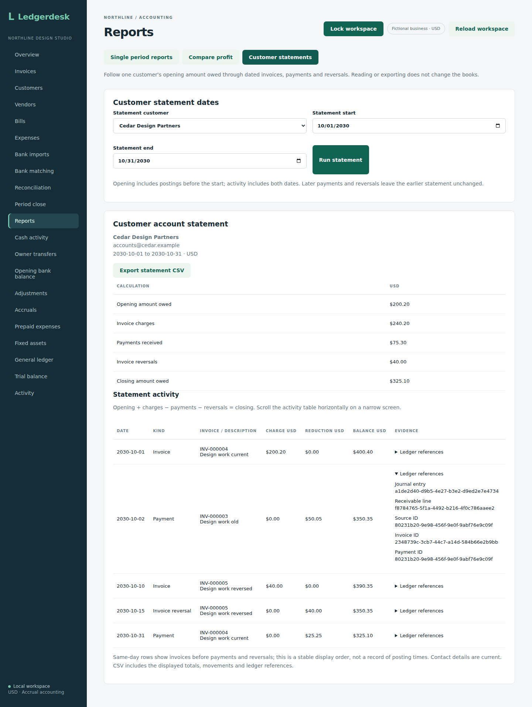

# Customer account statements

Customer statements connect an opening amount owed, invoice charges, payments and retained invoice reversals to a closing balance for an inclusive period. Open **Reports**, choose **Customer statements**, select a customer and dates, then choose **Run statement**. Owners, bookkeepers and reviewers can use it.

## Request and response

Use the workspace login with:

```text
GET /api/reports/customers/demo-customer/statement?startsOn=2026-10-01&endsOn=2026-10-31
```

Owners, bookkeepers and reviewers can read it. Responses use `Cache-Control: no-store`, USD and decimal-string monetary amounts. Dates must be within years 1–9999 with start on or before end. Missing/invalid dates or an unknown customer return HTTP 400; an account outside business 1 gives the same customer-not-found response. This scoped endpoint does not complete multi-business isolation elsewhere in the application.

The response includes the customer's current ID/name/email, selected dates, `openingBalance`, `charges`, `payments`, `reversals`, `closingBalance` and `movements`. Contact details are current information, not historical contact snapshots.

Each movement includes its posted date, kind (`INVOICE`, `PAYMENT` or `INVOICE_REVERSAL`), invoice number/description, charge, reduction and running balance. Entry, line, source, invoice and optional payment IDs trace it back to the books. A payment is linked to its invoice rather than treated as another invoice charge.

Rows sort by date. Within the same date, invoice charges come first, then payments, then reversals; invoice number and ledger IDs make ties stable. This is a presentation order for date-only accounting, not a claim about the time those actions happened.

## Accounting example

Suppose a September invoice of $300.30 received a September payment of $100.10. The October statement starts with $200.20 owed. In October:

- A new invoice adds $200.20.
- A payment against the older invoice reduces the balance by $50.05.
- Another invoice adds $40; its retained reversal reduces the balance by $40.
- A payment against the new invoice reduces the balance by $25.25.

October charges total $240.20, payments total $75.30 and reversals total $40. The closing balance is **$325.10**:

`opening + charges − payments − reversals = closing`

Opening uses attributable receivable journal lines strictly before the start; movements include both endpoints. A payment or reversal after the end cannot change that statement's figures, even though today's invoice paid/status fields have changed. Drafts have no postings and are excluded. An empty period still carries any earlier balance.

## Implementation and verification

The read uses one repeatable-read transaction. Customer, invoice and entry queries restrict their business scope. Journal lines for account 1100 provide the money; invoice/payment links supply the customer and document evidence. Java `BigDecimal` preserves cents and running balances. Reading creates no journal lines, activity entries or request keys.

Six integration tests cover known opening/movement/closing amounts, payment-to-invoice linkage, inclusive boundaries, agreement with dated receivable aging, unchanged accounting/activity/commands, later settlements and reversals, same-day ordering, exact split payments, stable line IDs, empty/date-limit cases, drafts/future invoices, other customers/businesses, authentication/reading roles, cache headers and invalid parameters. Run `mvn -f backend/pom.xml -Dtest=CustomerStatementTest test` against a disposable test database. Source `f6e64af527261dcb29d5dd5a72f40762535f04b1` passed all three jobs in [run 37230201532](https://github.com/Arhaam-Azhari/ledgerdesk/actions/runs/37230201532): 281 integration tests on each of H2 and PostgreSQL 17 with zero failures/errors/skips, 14 backup-tool tests, production frontend build, all 24 existing Chromium workflows and native PostgreSQL restoration. The initial test annotation import was corrected before this passing checkpoint. At that API checkpoint, browser checks covered existing screens. Statement-screen verification follows below.

This covers the supported invoice/payment/reversal workflow. Opening unpaid-document migration, credit notes, refunds, arbitrary receivable journals, foreign currencies, historical contact versions and delivery remain outside the scope. The screen and CSV are internal accounting tools. PDF statements and customer delivery are separate future workflows.


## Screen and CSV

The summary shows opening, charges, payments, reversals and closing. Activity rows show the invoice number/description, date, charge/reduction and running balance. Expand **Ledger references** to inspect the invoice, payment and journal IDs. On a phone, scroll the activity table horizontally; summary amounts remain visible above it. The screen explains same-day presentation order and current contact details.

**Export statement CSV** downloads the displayed customer/date context, totals, activity and ledger IDs. The filename uses the customer ID and both dates. Files are UTF-8 with a byte-order mark, quoted fields, CRLF rows and validated decimal money. Formula-looking contact/description text is prefixed with an apostrophe. Customer/date edits, workspace reloads, mode changes and failed reads clear old results before another export. Retry **Run statement** after a failed read; it does not change the books.

The screen builds locally. A new reports browser scenario checks the known $325.10 statement after later settlements, payment linkage, ledger references, CSV content, formula-looking names, a carried balance in an empty period, date errors, failed-read retry, cleared results, unchanged records and mobile horizontal scrolling. Reviewer/bookkeeper scenarios also run statements. Run `npm run test:reports`, `npm run test:reviewer` and `npm run test:bookkeeper` in `frontend` after packaging the backend and installing Chromium. Screen source `bd1358fe8504693277c6881c471e99e1d02fc944` passed all three jobs in [run 37231613956](https://github.com/Arhaam-Azhari/ledgerdesk/actions/runs/37231613956): 281 integration tests on each of H2 and PostgreSQL 17 with zero failures/errors/skips, 14 backup-tool tests, production frontend build, all 25 Chromium workflows and native PostgreSQL restoration. The first browser attempt stopped at an exact-label dropdown lookup; the corrected test uses its accessible role/name. Both original statement captures were downloaded and visually reviewed.


## Screen evidence

Cedar Design Partners uses the worked amounts above with fictional September–November 2030 dates. Its October statement still closes at $325.10 after the November payments settle the invoices. The desktop capture expands the $50.05 payment's ledger references. The mobile capture shows the visible summary and the activity table scrolled to its evidence column.



[Mobile statement summary and horizontally scrolled ledger evidence](screenshots/mobile-customer-statement.png)
