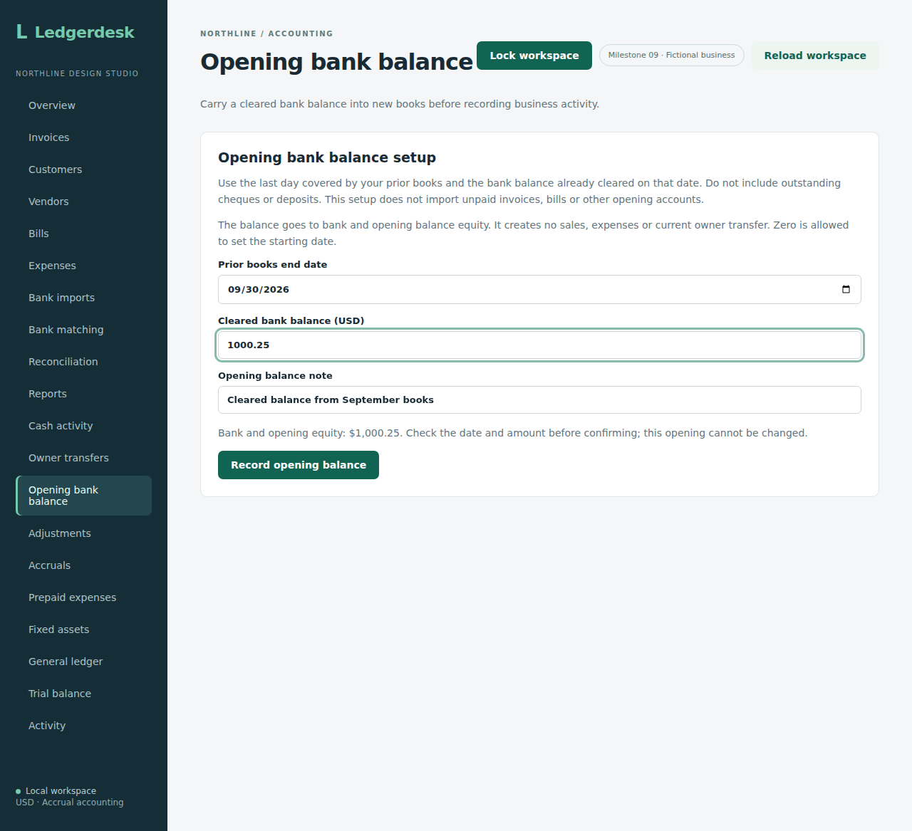
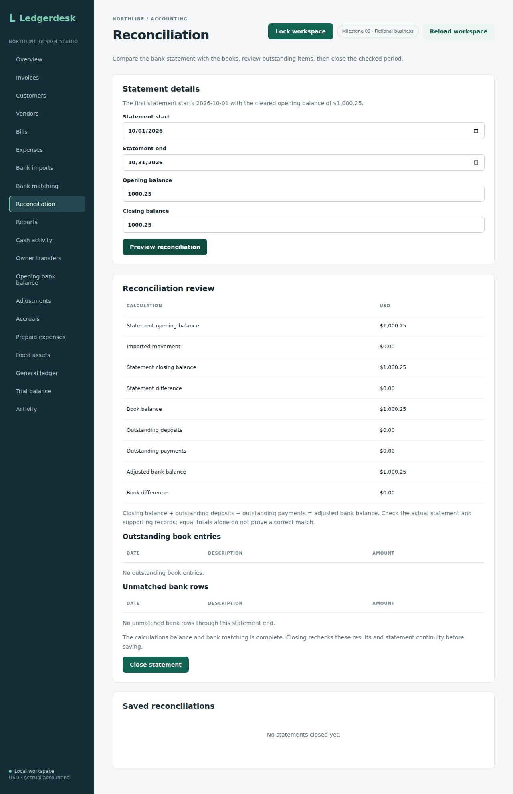

# Opening bank balance

This first opening-balance step carries one cleared bank balance into otherwise empty books. It is deliberately narrower than importing an existing business's complete trial balance. Customers, vendors and unposted invoice drafts can already exist; journal entries, bank imports and reconciliation records must not exist.

## Owner setup

Sign in as an owner and open **Opening bank balance** before posting transactions, importing bank rows or closing a statement. Enter the last date covered by prior books, the cleared bank balance and a short supporting note. Review the amount and confirm the permanent cutover. Cancelling confirmation saves nothing. After recording, the screen shows the retained date, amount and note rather than an editable form.

For example, record $1,000.25 on September 30. Open **Reconciliation**: the first statement defaults to October 1 with $1,000.25 opening balance. Enter the statement end and actual closing balance, preview and review before closing. **Cash activity** must use October 1 or later as its start. Do not count the opening as a new cash receipt. Setup is unavailable in books with existing posted activity; reviewers cannot record an opening.

The browser workflow exercises cancelled confirmation, invalid amounts, zero eligibility, a retry after a failed refresh, retained desktop/mobile views, cash and equity reporting, and two consecutive statement closes. Run `npm run test:opening` after packaging the backend. CI uploads its screenshots with the browser results. Source `26ebaa044f0a7862a5b5fb81b0c48436870b453b` passed [run 37111654985](https://github.com/Arhaam-Azhari/ledgerdesk/actions/runs/37111654985): 239 integration tests on each of H2 and PostgreSQL 17, no failures/errors/skips, 14 backup-tool tests, production frontend build, all 21 Chromium workflows and the real PostgreSQL restore check. The opening browser workflow completed against the packaged backend.

## Accounting and API

An owner posts `POST /api/opening-bank-balance` with an idempotency key, CSRF and a JSON body:

```json
{"asOf":"2026-09-30","balance":"1000.25","memo":"Cleared bank balance from prior books"}
```

The date is the last day covered by the prior books. Ordinary postings and bank imports begin the next day. The amount is nonnegative, at most 12 whole digits and two decimal places; zero is supported. The date must leave room for the next supported day. `GET /api/opening-bank-balance` returns retained metadata to authenticated readers; the workspace includes `openingBankBalances` too.

For a positive balance, the entry debits business bank 1000 and credits opening balance equity 3200. It creates no revenue, expense, customer/vendor document or current owner-transfer record. Zero retains the date boundary without inserting invalid zero journal lines. Account 3200 is a separate opening-equity offset, not a completed allocation of a business's historical equity.

The first statement must start exactly the day after `asOf` and carry that exact balance. A later statement follows the existing continuity rules. The opening line contributes to the book balance but is excluded from outstanding deposits/payments and cannot be matched to an imported transaction. For $1,000.25 opening and no new movements, the first statement closes at $1,000.25 with no differences or outstanding deposit.

Cash activity must start after the opening date. Its opening cash includes the carried amount while period receipts/payments include only later movements. Dated balance sheets and trial balances include the opening entry from its date; profit remains zero. Postings/imports on or before the opening date are rejected, preventing older activity from being counted twice.

Setup, journal, command key and activity share the existing business lock and transaction. One unique opening record per business prevents competing setups. An exact retry returns its retained ID, including after a statement is closed; changed details under the same key or a second setup are rejected. There is no edit/delete/reversal endpoint in this checkpoint: confirm the cutover date and cleared amount before recording it.

Ten new integration tests cover equity/profit/cash calculations, first-statement behavior and continuity, invalid openings, zero cutoffs and rollback, setup guards, idempotency, audit rollback, concurrent setup and endpoint permissions. Source `204d87e85a49f242d2220f3b373707203f85dad5` passed [run 37085909865](https://github.com/Arhaam-Azhari/ledgerdesk/actions/runs/37085909865): 239 integration tests on each of H2 and PostgreSQL 17, no failures/errors/skips, 14 backup-tool tests, production frontend build, all 20 existing Chromium workflows and the PostgreSQL restore job. The browser suite verifies regression behavior; the opening-specific browser workflow was added in the subsequent UI checkpoint described above.

This supports a bank balance already cleared at cutover. Opening receivables/payables, equipment/prepaids, accrued liabilities, overdrafts, outstanding cheques/deposits, historical equity allocation and a complete opening trial balance are not imported here. Use fresh books without an opening record for the existing zero-start workflow. The local Basic-authentication and single-business limitations remain.

## Reviewed screenshots

These are unmodified Chromium captures from the opening workflow, using fictional data. The desktop and 390-pixel mobile views were inspected for readable text and usable controls. The older “Milestone 09” header badge is a presentation label, not the test count or PR number.

- [Setup before confirmation](screenshots/opening-setup.png): September 30 cutover and $1,000.25 cleared bank balance.
- [Retained opening](screenshots/opening-recorded.png): the recorded date, amount and supporting note replace the form.
- [Mobile retained opening](screenshots/opening-mobile.png): narrow-screen layout without page overflow.
- [First statement review](screenshots/opening-reconciliation.png): opening/book/adjusted bank balance $1,000.25; differences and outstanding items zero.





The screenshots show the setup and review; the browser assertions additionally confirm successful October and November closes, exact retry without duplication, zero profit, matching assets/equity and no new cash receipts. They do not demonstrate a complete historical migration or opening-data restoration after backup.


The later [opening balance restoration checks](opening-balance-restoration.md) verify retained opening metadata and keys, a closed first statement, dated reports and cutover protections after an actual separate-database restore.
