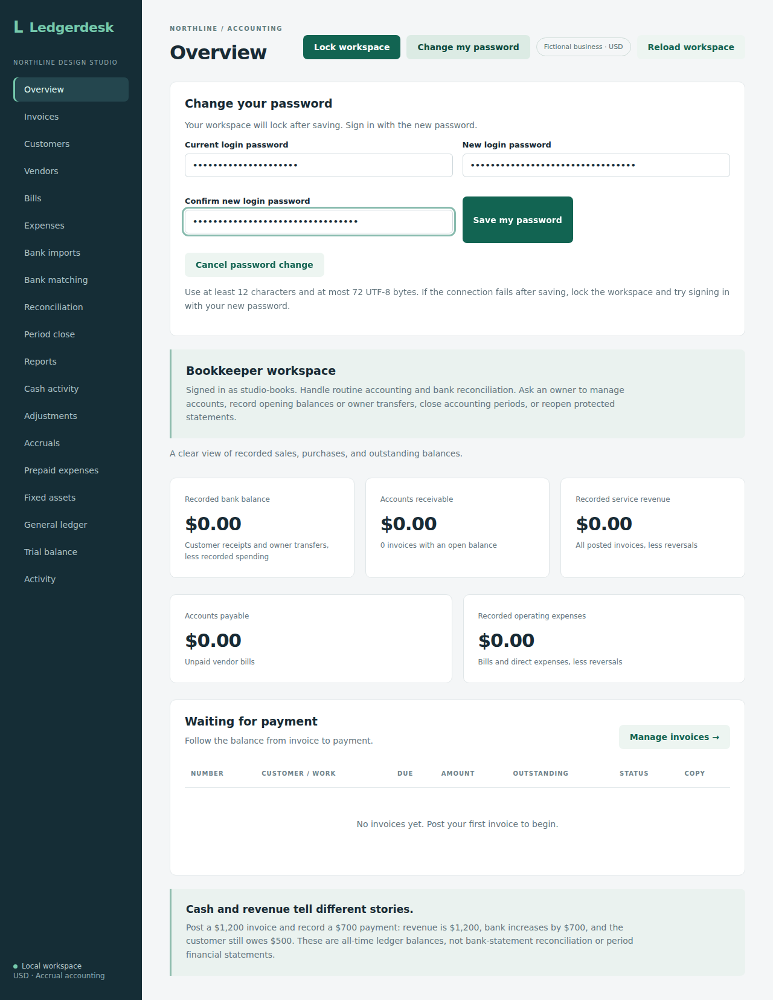

# Change your own password

Stored owners, bookkeepers and reviewers can use **Change my password** in the workspace header. Enter the current password, a different new password and its confirmation, then choose **Save my password**. Use at least 12 characters and at most 72 UTF-8 bytes. The workspace locks after a confirmed save; sign in with the new password. Cancel closes the form and clears its fields.

A wrong current password leaves the stored hash unchanged. The form clears secret fields after a submitted request, whether it succeeds or fails. If the connection fails after the server saves, lock the workspace and try the new password. An old-password retry cannot undo or duplicate the change. If neither password works, ask an owner for an account reset or follow the existing offline owner recovery instructions when appropriate.

This changes the authenticated account only. `POST /api/me/password` accepts `currentPassword` and `password`, requires authentication and CSRF, and resolves the account from the authenticated username. It accepts no target account ID, username or role. The business lock serializes password/access changes; an enabled membership in this business and a matching current password are rechecked before updating. Password hashes and the `ACCOUNT_SELF_PASSWORD_CHANGED` activity event commit together. No password, password hash or change-request body is stored in command history or returned by the endpoint. Its response uses `Cache-Control: no-store`.

Reviewers retain read-only accounting access, and bookkeepers retain their existing limits. Neither gets access to account lists or other users' resets. Configured-login mode has no editable stored password; it omits the header control and the endpoint rejects attempts. Owner administration and offline recovery remain available separately.

## Verification

The production frontend build and diff checks pass locally. Eight new backend checks cover every stored role, current-password validation, CSRF/authentication, target/role injection, disabled or other-business accounts, activity rollback, Unicode byte limits and configured-login rejection. The isolated Chromium workflow covers all roles, mismatched confirmation, a wrong current password, cancellation, cleared fields, desktop/mobile views, confirmed lock/sign-in and a server save whose response is deliberately lost.

Source `34ee4556de713a685639bd69de6aeb3823f4ed09` passed [run 37184170212](https://github.com/Arhaam-Azhari/ledgerdesk/actions/runs/37184170212): 269 integration tests on each of H2 and PostgreSQL 17, zero failures/errors/skips, 14 backup-tool tests, production frontend build, all 24 Chromium workflows and the existing PostgreSQL restore check. Both original captures were downloaded and visually reviewed for readable labels, instructions and action controls; the mobile page stays within its width. Run `npm run test:password` from `frontend` after packaging the backend and installing Chromium; keep ports 8097 and 5189 free. This remains local Basic authentication; changing a password does not establish a hosted session revocation design.

## Reviewed captures

[Desktop password form](screenshots/password-editor.png) and [390-pixel mobile form](screenshots/password-mobile.png) use a fictional bookkeeper account and masked fields. The workflow also changes reviewer and owner passwords, verifies old-password rejection and new-password sign-in, and checks that non-owners still cannot open account administration.

The existing restore scenarios passed as regressions. A self-changed password followed through restart and backup is not part of this new browser fixture.
