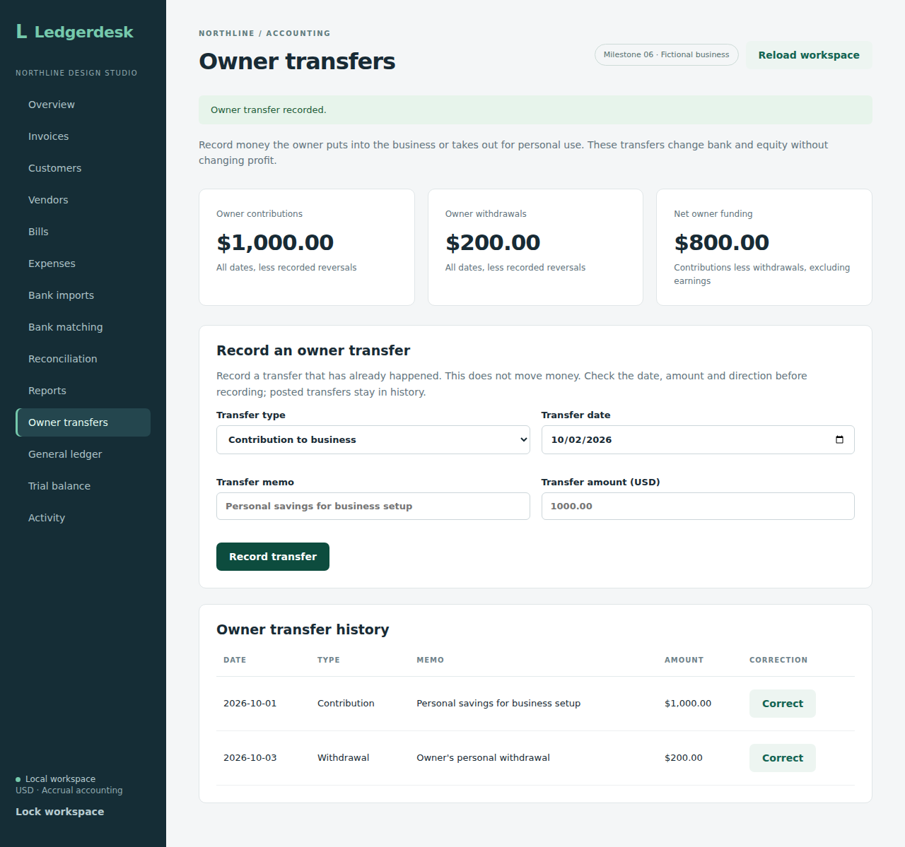
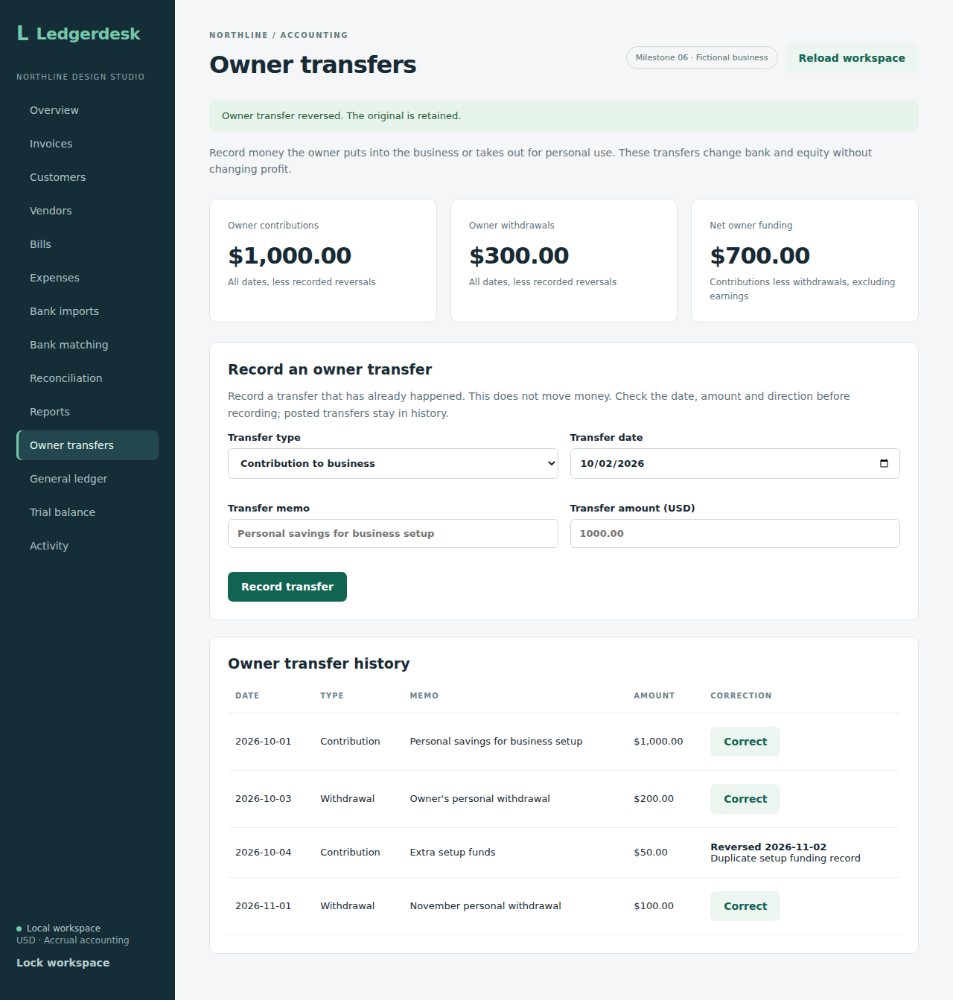

# Owner funding and withdrawals

This checkpoint adds the posting API and bank matching for a single owner of the demo business. The browser form records contributions and withdrawals and lists their retained history. Mistaken records can be reversed with a date and reason while retaining the original. It does not model share issuance, multiple owners, loans or tax treatment.

`POST /api/equity` requires the workspace credentials, CSRF token and `Idempotency-Key`. Supply `kind` (`CONTRIBUTION` or `DRAWING`), `postedOn`, `memo` and a positive decimal `amount` with at most two decimal places. The state endpoint returns the retained records in `equityTransactions`.

A contribution debits Business bank (1000) and credits Owner contributions (3000). A drawing debits Owner drawings (3100) and credits Business bank. Drawings have a debit equity balance, reducing total owner equity. Neither changes revenue, expenses or customer/vendor aging. A $1,000 contribution followed by a $200 drawing leaves bank and posted equity at $800, with no profit. There is no bank connection: record a transfer that actually happened, rather than treating this as a money-transfer command. As elsewhere in the demo, negative recorded bank balances are possible.

The business lock, exact decimal journal helper, request-key check and activity record are shared with existing postings. The retained transfer, two journal lines and activity event commit together. Closed reconciliation dates reject new transfers. Retrying a successful command returns its existing ID, including after the period closes; changed details cannot reuse that key.

Owner cash entries appear as bank matching candidates with their direction and memo. The same one-to-one amount checks apply. Pending funding is an outstanding deposit and pending drawings are outstanding payments during reconciliation. Importing or matching a statement does not post the owner transfer again.

Migration V7 adds the two accounts and transfer table without changing earlier migration files. General adjustments remain pending. Owner records have no edit/delete endpoint; corrections retain both the original and the dated offset. Correction verification is recorded below.

Eight integration tests cover exact contributions/drawings and equity reports, historical cutoff, request retries/conflicts, input validation, transaction rollback, matching/reconciliation with closed-date protection, outstanding funding, and endpoint authentication/CSRF/request keys. All 109 backend integration tests passed on H2 and all 109 passed on PostgreSQL 17, with zero failures, errors or skipped tests in [run 36941728558](https://github.com/Arhaam-Azhari/ledgerdesk/actions/runs/36941728558), source `38b9202ce48d2ab38f730bfdcc0b0c78a14bacd8`. The production frontend build and all ten existing Chromium workflows also passed. Those browser checks cover existing screens; the later owner-form checkpoint is documented below.

## Browser workflow

Open **Owner transfers**. Choose Contribution to business or Withdrawal for owner, enter the actual transfer date, a memo and a positive USD amount, then choose **Record transfer**. Totals and history include all recorded dates, including future dates; use Reports for a historical cutoff. Net owner funding excludes accumulated earnings.

After an uncertain refresh, the form retains its details and request key so retrying the same transfer does not record it twice. Editing the details starts a different command; reload and inspect history first if the result is uncertain.

Build the backend JAR as described in the reporting notes, install frontend dependencies and Chromium, then run `npm run test:equity` in `frontend`. The isolated check uses ports 8083 and 5176. It checks both directions, historical equity without profit, invalid decimal precision, an interrupted refresh and exact-once retry, retained history, and a 390-pixel layout. The final screen passed all 109 backend tests on each of H2 and PostgreSQL 17, the production frontend build, and all eleven Chromium workflows in [run 36942772413](https://github.com/Arhaam-Azhari/ledgerdesk/actions/runs/36942772413), source `7cdd41c80931aff69706b25921ea37187749402a`. The new owner workflow confirmed that a failed refresh followed by a retry creates one transfer, and that a November withdrawal leaves the October balance sheet unchanged. Desktop and mobile captures were downloaded and visually reviewed. The mobile history scrolls horizontally to keep dates readable.

[Mobile owner transfer screen](screenshots/mobile-owner-transfers.png)

## Correcting a mistaken record

In Owner transfer history, choose **Correct** beside the mistaken transfer. Enter a correction date on or after the original date and a short reason, then choose **Reverse mistaken transfer**. The original remains visible with its reversal date and reason. Record the corrected replacement separately when needed. A real transfer of money back is a new owner transfer in the opposite direction, rather than a correction of a record that was accurate.

A matched transfer must be unmatched first. A closed original date or closed correction date blocks the reversal; reopen the latest reconciliation through the existing workflow before changing a closed period. Reversed original transfers are excluded from bank matching candidates. Their offset entries remain in the ledger and reconciliation calculations; unbanked mistakes and their reversals cancel in the net book balance. Imported statement rows still need a correct replacement match or other resolution.

Migration V8 retains one reversal per transfer. The reversal row, offsetting journal, command and activity record commit together under the business lock. Retrying the same reversal returns its existing ID; another key cannot reverse the same transfer twice. The historical balance sheet includes the original until the reversal date. Current owner totals subtract all recorded reversals, including future dates; use Reports for a dated balance.

Eight additional backend checks cover both directions, earlier balances, retained journal lines, duplicate/conflicting retries, invalid dates/reasons/IDs, transaction rollback, matched/closed protections and net reconciliation. The owner browser check now reverses a transfer, simulates an interrupted refresh, retries without duplicating the offset, and compares earlier/later equity. All 117 backend tests passed on each of H2 and PostgreSQL 17, the production frontend build passed, and all eleven Chromium workflows passed in [run 36943949702](https://github.com/Arhaam-Azhari/ledgerdesk/actions/runs/36943949702), source `76252166133c9bc92366f593fc5d7fecc813ffcd`. This includes the interrupted reversal refresh and exact-once retry, earlier/later equity, and mobile date readability. The three owner screenshots in these notes were refreshed from that final run and visually reviewed.

