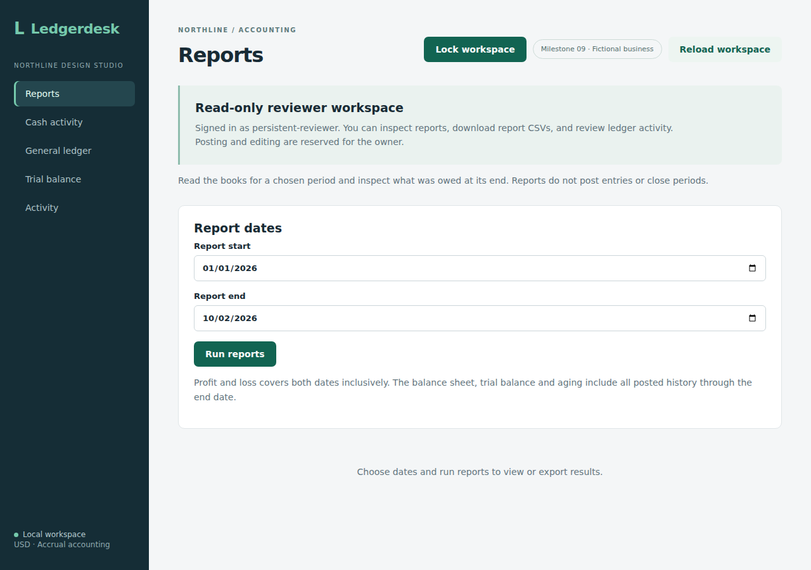
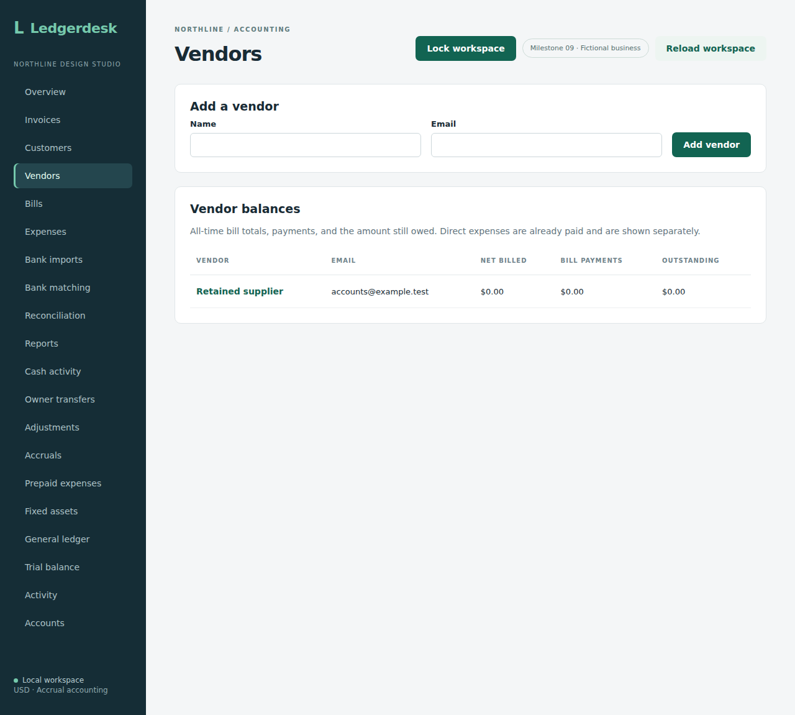

# Persistent accounts

Set `APP_ACCOUNTS_PERSISTENT=true` to use database-backed account authentication. The default remains the existing configured-login mode. Migration V18 creates users with BCrypt password hashes and enabled state, plus constrained OWNER/REVIEWER memberships tied to a business. This installation still selects business 1; it does not yet offer switching between businesses.

On first startup with an empty user table, the existing owner configuration seeds the owner and an optional configured reviewer. Passwords must contain at least 12 characters and at most 72 UTF-8 bytes. Usernames are exact, one to 100 characters without surrounding whitespace. Setup locks the business row and validates both accounts before writes. A transaction failure leaves no partial setup.

Once any user exists, startup never overwrites passwords, roles or enabled state. Changing bootstrap environment credentials does not rotate stored credentials or create new accounts. Keep bootstrap credentials outside version control. The [owner account-management API](account-management.md) now supports creation, access changes and password resets. The administration screen and [offline recovery command](account-recovery.md) now have dedicated workflow checks. Reviewed screenshots are included below; hosted authentication and real-business deployment remain separate work.

Authentication loads the stored hash, enabled state and membership role for business 1 on each user lookup. A user with membership only in another business cannot authenticate into this installation. Existing owner/reviewer request authorization remains the same. This is still local Basic authentication, not a hosted session system.

Six integration tests cover hash storage, loading through a new service instance, role and enabled-state persistence, non-overwriting startup, business membership filtering, validation/atomic setup, password byte limits and selecting the persistent security provider. Source `05d92a7fb7e99b89feae2c8437e7757f717f8f83` passed [Actions run 37064984941](https://github.com/Arhaam-Azhari/ledgerdesk/actions/runs/37064984941): 215 integration tests on each of H2 and PostgreSQL 17, zero failures/errors/skips, production frontend build and all 18 existing Chromium workflows. These browser checks cover compatibility-mode regression behavior, not a persistent-account restart. The service-instance test alone is not a process-restart test; the additional workflow below supplies process-restart evidence. The account-management API is documented separately; its screen and recovery verification are documented separately.

## Real process-restart verification

Source `df4131358d8ed951ebc2b80c63a7d68298f5bff6` passed [Actions run 37067193109](https://github.com/Arhaam-Azhari/ledgerdesk/actions/runs/37067193109): 215 integration tests on each of H2 and PostgreSQL 17, no failures/errors/skips, production frontend build and all 19 Chromium workflows.

The dedicated persistent workflow starts the packaged Java app with an isolated file-backed H2 database and database-backed authentication enabled. It authenticates the owner, writes a supplier, sends SIGTERM and waits for the process to exit. It starts a new process against the same file using changed bootstrap passwords. Those changed passwords return 401; the original stored passwords authenticate with their original owner/reviewer roles. The supplier survives, and a reviewer POST with valid CSRF returns 403. Real browser logins then show the reviewer workspace and the owner's retained supplier.

This proves a graceful application restart against the same local database file. It does not establish crash recovery, backup restoration, PostgreSQL process restart or hosted session behavior. PostgreSQL integration tests cover account storage and membership rules separately.

Run `npm run test:persistent` in `frontend` after building the backend JAR and installing Chromium; ports 8091 and 5184 must be free. The test owns the Java processes and removes its temporary database after shutdown. The final workflow also stops the second backend, runs the actual packaged recovery command, starts a third backend, and checks old-password rejection, restored owner access, retained supplier data and recovery activity. See [recovery proof](account-recovery.md). Source `9904cb9fe4b714323abcde02c4b0c5926e0dc472` passed [run 37075785948](https://github.com/Arhaam-Azhari/ledgerdesk/actions/runs/37075785948), with 229 tests on each database and 20 browser workflows.

These original post-restart captures were downloaded from that run and reviewed. They show the first restart; recovery is proved by command-process assertions, rather than these screenshots. The header retains the earlier milestone label used at capture time.

