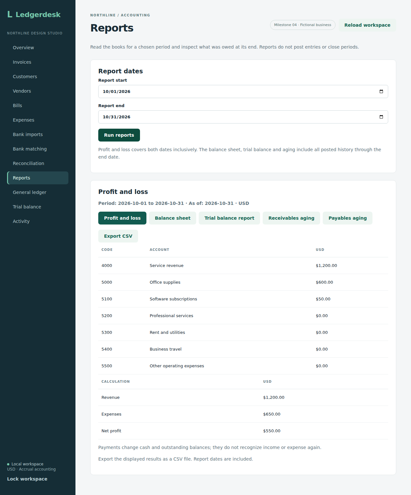
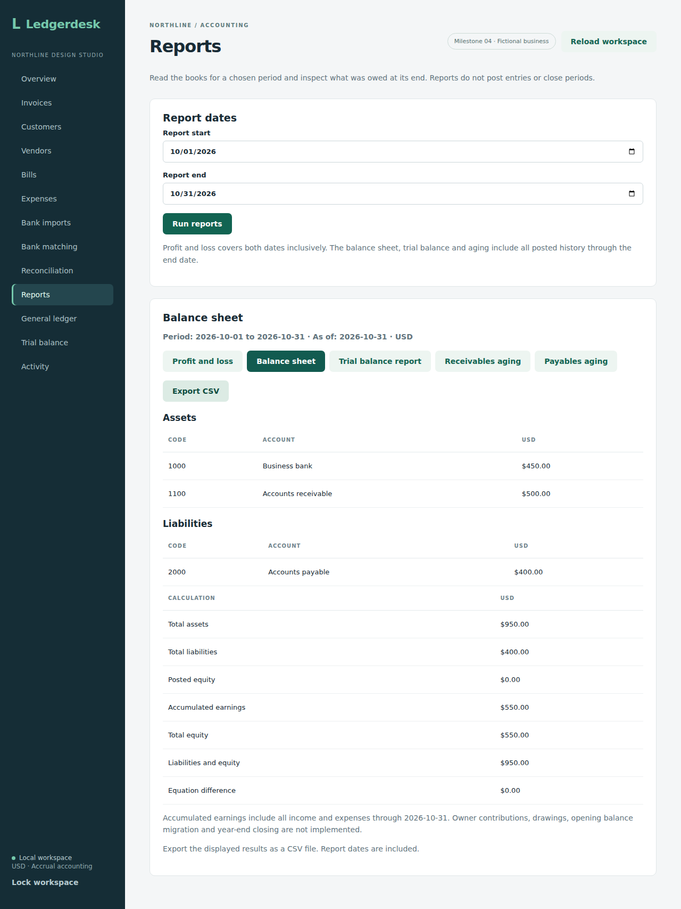
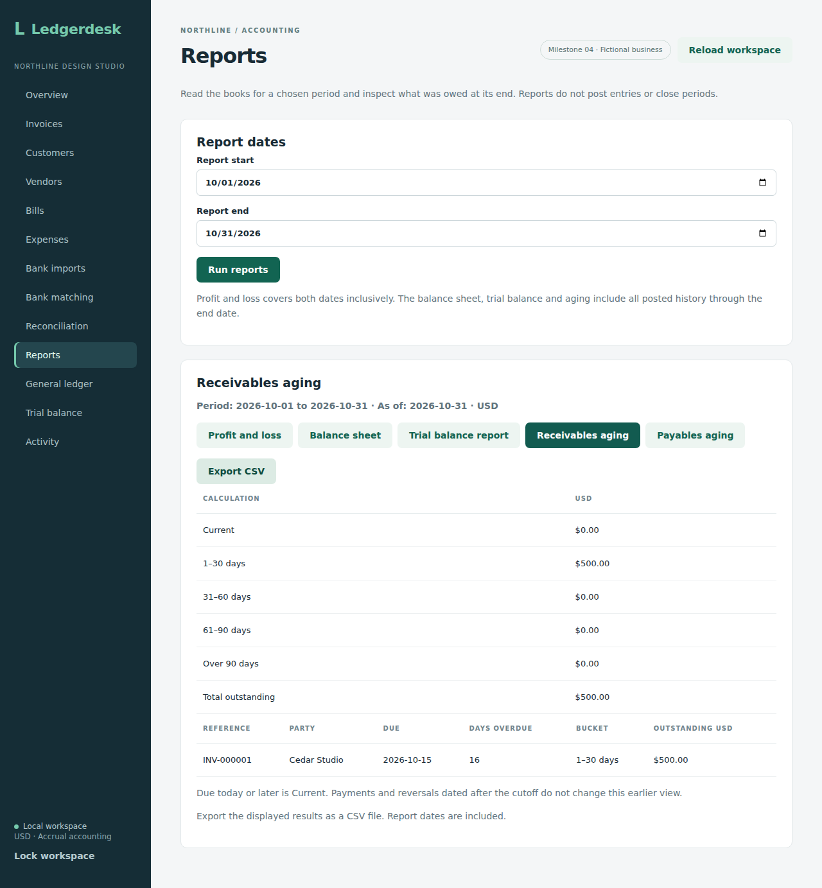

# Period reports and aging

Reporting is read-only; the browser screen includes all five report views and CSV exports. It covers profit and loss, an end-date trial balance and balance sheet, and customer/vendor aging for the single USD business.

The [profit comparison API](profit-comparison.md) adds two-period category and total changes. Its browser editor/export follows separately; this guide describes the existing single-period screen.

## API and dates

`GET /api/reports?startsOn=2026-10-01&endsOn=2026-10-31` requires the workspace login and returns `Cache-Control: no-store`. Dates are inclusive and must form a valid period. Money is returned as decimal strings, as elsewhere in the application. All parts of the response use one repeatable-read transaction.

| Report | Dates included |
| --- | --- |
| Profit and loss | Journal postings from the start through the end |
| Trial balance and balance sheet | Every journal posting through the end, including earlier periods |
| Receivables/payables aging | Documents and payments posted through the end, aged against that end date |

Profit is revenue minus operating expenses. Revenue uses credits minus debits; expenses use debits minus credits. A payment reduces a receivable or payable and changes cash, without recognizing revenue or expense again. Reversals appear in the period where they were posted, so a later correction can produce negative income or expense for that period. Drafts have no journal entries and contribute nothing.

The trial balance shows net debit/credit balances, including zero accounts, rather than gross journal turnover. Its two totals should agree. The report end date is independent of the start: changing the start affects profit and loss, but does not drop earlier balances from the trial balance or aging reports.

## Balance sheet

The balance sheet uses the same end-date account balances as the trial balance. Assets use debit minus credit; liabilities and posted equity accounts use credit minus debit. It returns account lists, totals, accumulated earnings, liabilities plus equity, and an equation difference:

`assets − liabilities − total equity = difference`

Accumulated earnings include all revenue minus expenses through the end date, including earlier periods and dated reversals. This is independent of the selected profit-and-loss start date. Earnings are calculated from income/expense postings; they are not set to whatever amount would make the sheet balance. A nonzero difference therefore remains visible if the underlying records are inconsistent.

The chart includes bank, receivables, payables, owner contributions and owner drawings. Posted equity is contributions minus drawings; accumulated earnings remain a separate component. The owner posting API is described in [owner equity notes](owner-equity.md). Opening balance migration and formal year-end closing need later workflows. Negative bank balances and losses remain signed amounts; overdraft reclassification is not implemented.

In the known example below, assets are $950 ($450 bank plus $500 receivables), liabilities are $400, and accumulated earnings/equity are $550. Both sides equal $950. A later customer payment changes the mix of bank and receivables without recognizing more income or changing the earlier dated balance sheet.

## Historical aging

Current document status and paid totals cannot describe an earlier date. Aging instead uses original/reversing journal postings through the cutoff and allocated payments dated through that same cutoff. A payment or void dated next month therefore leaves this month's outstanding balance visible. Fully settled or reversed documents have no remaining aging item after the relevant date.

Each item includes its invoice number or vendor bill reference, party, due date, days overdue, bucket, and outstanding amount. Items due today or in the future are **Current**. Overdue buckets are **1–30**, **31–60**, **61–90**, and **Over 90 days**. The response includes per-bucket and overall totals. Direct expenses are already paid and create no payable aging item.

These are reports for the supported posted-document workflows. Credit notes, refunds, arbitrary journal adjustments, foreign currency, opening balance migration, tax reporting, and formal financial-statement compliance are outside the current scope. An authenticated read does not post entries, close a period, or change the reconciliation history.

## Example

For a period containing a $1,200 service invoice, $700 customer payment, $600 bill, $200 bill payment, and $50 direct expense:

- Revenue is $1,200, expenses are $650, and net profit is $550.
- Bank is $450, receivables are $500, and payables are $400.
- Trial balance net debit and credit totals are each $1,600.
- Aging totals are $500 receivable and $400 payable, distributed by their due dates.

These figures assume no other postings through the cutoff. A later payment changes later reports while preserving the earlier dated view.

## Verification

Eight integration tests cover accrual profit versus payments, inclusive period boundaries, cumulative balances, historical customer/vendor payments and voids, later-period reversals, every aging bucket boundary, drafts/future expenses, unchanged journal lines, valid dates, authentication and cache headers. All 94 backend integration tests passed on H2 and all 94 passed on PostgreSQL 17, with zero failures, errors, or skipped tests in [run 36930198727](https://github.com/Arhaam-Azhari/ledgerdesk/actions/runs/36930198727), source commit `b6473e37f8a577d8a4355430a5ca221d9462b201`. The frontend production build and all nine existing Chromium workflows also passed. At that checkpoint, browser results covered the existing invoice, purchase and bank screens; the completed reporting workflow is documented below.

The balance sheet sprint adds seven integration tests for known assets/liabilities/equity, prior-period earnings, historical payment composition, negative cash/losses, dated expense corrections, empty/exact-decimal balances, future-entry exclusion, and a deliberately unbalanced diagnostic fixture. All 101 integration tests passed on H2 and all 101 passed on PostgreSQL 17, with zero failures, errors or skipped tests in [run 36932036330](https://github.com/Arhaam-Azhari/ledgerdesk/actions/runs/36932036330), source commit `44b392ba065990f346e9927b55620108b2a698d6`. The production frontend build and all nine existing Chromium workflows also passed. The reports browser checkpoint is recorded separately below.

## Browser workflow and CSV exports

Open **Reports**, enter an inclusive start/end date, and choose **Run reports**. Switch between **Profit and loss**, **Balance sheet**, **Trial balance report**, **Receivables aging**, and **Payables aging**. Every result shows its selected dates and currency. Editing a date or reloading the workspace clears the old results; run the reports again before exporting.

**Export CSV** downloads the currently selected view using the displayed results. The filename contains the view and dates. Files use UTF-8 with a byte-order mark, quoted fields, CRLF rows, decimal monetary amounts, and report/date/currency context. Aging files include document items and bucket totals. These are human-readable report exports, not a bank-import format or an import contract for another accounting application.

User text that could start a spreadsheet formula is prefixed with an apostrophe, including text starting with `=`, `+`, `-`, or `@` after whitespace. ASCII control characters in text are normalized to spaces. Quotes and commas are escaped. Monetary fields are separately validated decimal amounts so negative balances remain numbers. Spreadsheet applications may choose their own display formatting; the exported amounts remain plain decimal strings in the file.

The browser read and export create no journal or activity entries. A failed request clears the result and can be retried. Report dates do not close an accounting period or change an existing reconciliation.

### Run the browser check

From the repository root, build the backend with `mvn -f backend/pom.xml package -DskipTests`. In `frontend`, run `npm ci`, install Chromium with `npx playwright install chromium`, then run `npm run test:reports`. This starts an isolated in-memory demo backend on port 8082 and frontend on port 5175, and stops them afterward. Keep those ports free.

The workflow seeds fictional October invoices, payments, bills and expenses, along with November settlement payments and a separate future invoice. It checks known profit/balance/aging figures, exports every view and inspects downloaded content, tests formula-looking party text, changes the cutoff, clears obsolete results, retries a failed read, compares unchanged books/activity, and checks a 390-pixel layout. All 101 backend tests passed on each of H2 and PostgreSQL 17, the production frontend build passed, and all ten Chromium workflows (nine existing plus the isolated reporting check) passed in [run 36939023042](https://github.com/Arhaam-Azhari/ledgerdesk/actions/runs/36939023042), source commit `be64096a897e080169c5fe38f583cbfc371601ee`. The downloaded CSV contents were inspected by the browser test. Desktop and mobile captures were downloaded and visually reviewed; an aging-column width issue was corrected before this final run.

[Mobile report view](screenshots/mobile-reports.png)
