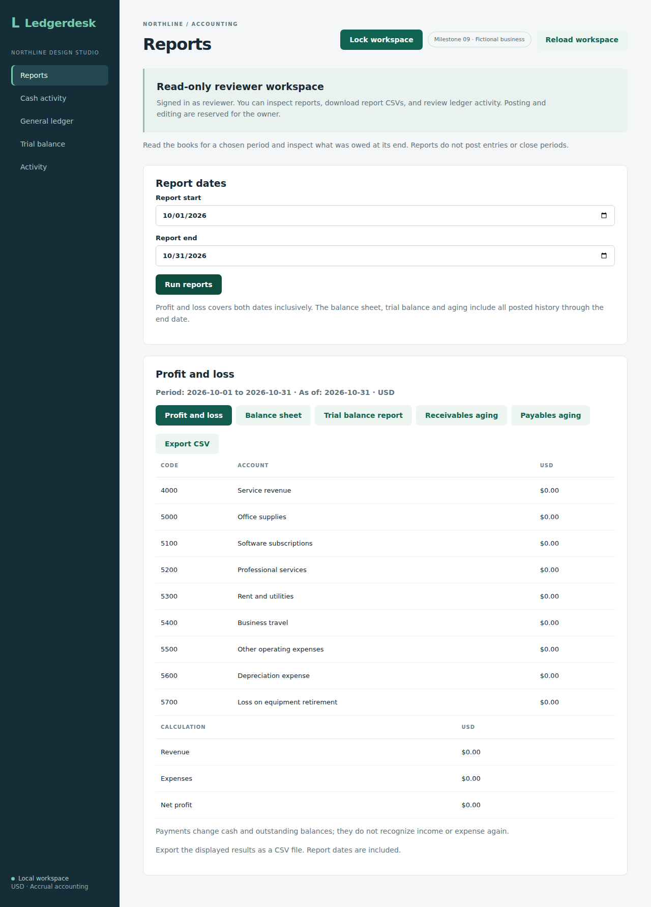
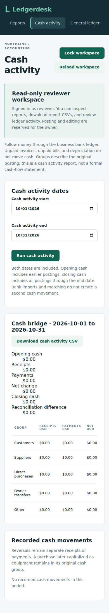

# Reviewer access checkpoint

An optional configured reviewer can read authenticated GET/HEAD routes but cannot post, edit, delete or call any future write route. The owner remains the only role allowed to use other HTTP methods, and CSRF protection still applies. The security filter enforces this before a controller runs; hiding a button is not the authorization boundary.

Configure `app.reviewer.username` and `app.reviewer.password` together using an external configuration file or Spring environment variables `APP_REVIEWER_USERNAME` and `APP_REVIEWER_PASSWORD`. The reviewer username must differ from the owner. Leave both unset to retain an owner-only installation. Do not commit real passwords. Passwords are BCrypt encoded in the in-memory user store at startup.

`GET /api/access` returns username, role and `canWrite` with `Cache-Control: no-store`. The frontend reads identity and workspace data before opening the books. Reviewer navigation contains Reports, Cash activity, General ledger, Trial balance and Activity, with a visible read-only notice. Mutation screens are hidden; the server still rejects direct write attempts. Demo reviewer credentials are not enabled by default.

Five integration tests check real reviewer credentials, report/state reads, valid-CSRF blocked writes across accounting modules, PATCH/DELETE/future-route denial, owner writes with CSRF, identity response and invalid/anonymous access. Source `763539c3644fbd4c75ce9035f59d1a8bbf756639` passed [Actions run 37057019239](https://github.com/Arhaam-Azhari/ledgerdesk/actions/runs/37057019239): 209 integration tests on each of H2 and PostgreSQL 17 with no failures/errors/skips, the production frontend build and all 17 existing Chromium workflows. These browser checks cover owner regression behavior; reviewer-specific browser proof remains for the next checkpoint. Persistent users, account management, bookkeeper roles, business memberships and hosted sessions remain future work. This is still the single-business local Basic-auth development setup.

## Reviewer workspace verification

Source `353af6d17402a28942e9d54743dc1eff0448e64a` passed [Actions run 37061714636](https://github.com/Arhaam-Azhari/ledgerdesk/actions/runs/37061714636): 209 integration tests on each of H2 and PostgreSQL 17, zero failures/errors/skips, production frontend build and all 18 Chromium workflows. The dedicated workflow opens the reviewer workspace, checks read-only navigation and report/CSV availability, reads cash activity, tests phone width, confirms a direct API write returns 403, locks the workspace and signs back in as the owner.

The first browser run found that the sidebar lock button was hidden on mobile. It was moved to the header for both roles, and the full suite passed after that fix. Locking clears frontend credentials, permission state and workspace data. This remains local Basic authentication, not a hosted session logout system.

Run `npm run test:reviewer` after building the backend JAR and installing Chromium; ports 8090 and 5183 must be free. The isolated test enables fictional reviewer credentials without changing the default demo. Desktop/mobile captures from the passing run were downloaded and visually reviewed; both are included below. The notice, report controls and header lock fit their viewports.

## Setup and permissions

The owner login uses the existing configuration. Set both reviewer environment variables before starting the backend and restart to apply account changes. A missing reviewer value or duplicate owner username stops startup with a configuration error. There is no account administration screen or database user record yet.

| Capability | Owner | Reviewer |
| --- | --- | --- |
| Read authenticated reports and ledger data | Yes | Yes |
| Download displayed report CSVs | Yes | Yes |
| Post, edit, reverse, match or close records | Yes, with CSRF | No |
| Manage user accounts in the app | Not implemented | Not implemented |

Reviewer permissions apply to authenticated GET/HEAD routes on this local single-business installation. UI navigation is deliberately limited to report and ledger views. The security filter requires the owner role for every other method, including future write routes. Basic authentication remains a development setup; frontend locking is not a hosted-session logout.

## Browser proof

These original screenshots use an empty fictional business to show permission controls. Backend and browser tests supply the evidence that reads succeed and writes receive 403. The application badge reflects the label at capture time.

