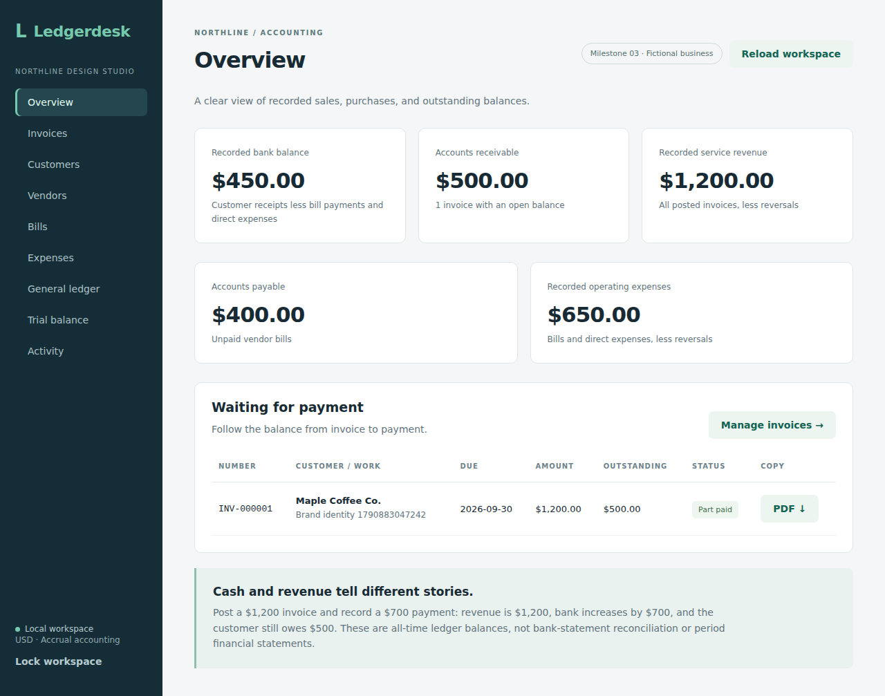
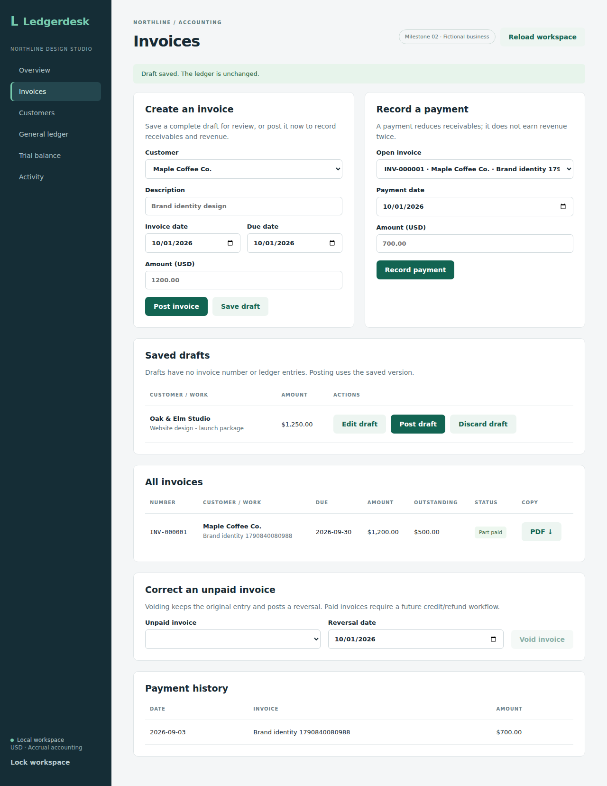
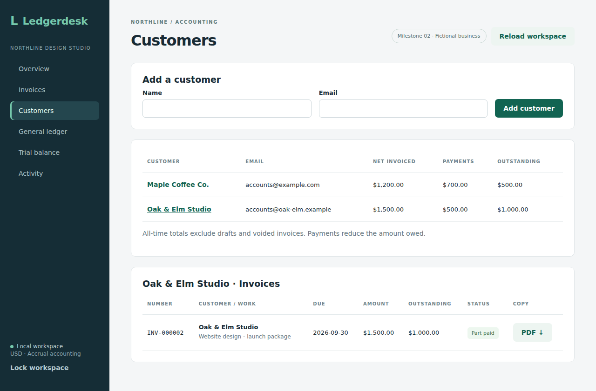
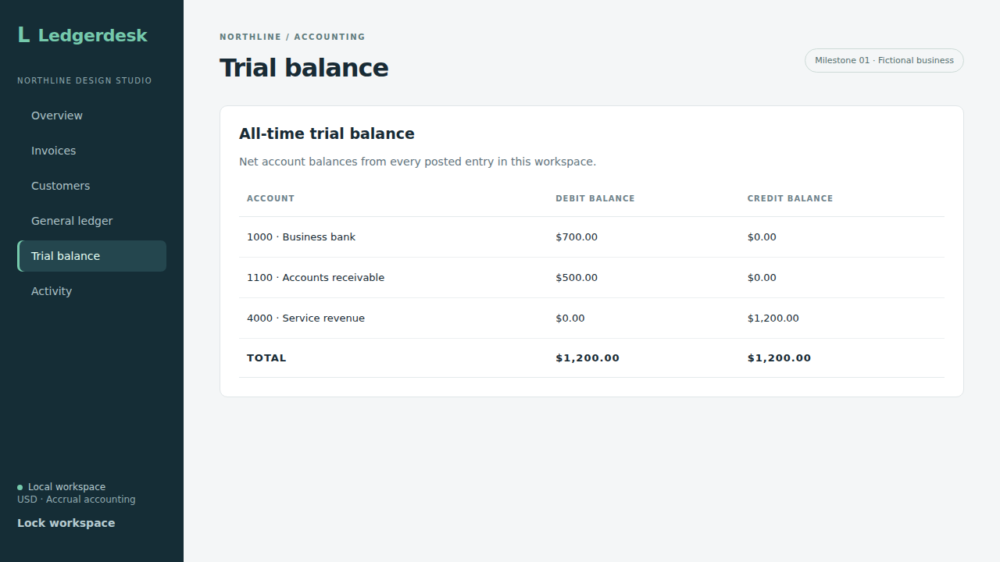

# Verification

Checks are recorded per milestone. Prepared checks are not counted as passing checks.

## Bank reconciliation milestone

The bank milestone passed **86 integration tests on H2**, **86 on PostgreSQL 17**, the frontend production build, and **nine Chromium workflows** in [run 36928181272](https://github.com/Arhaam-Azhari/ledgerdesk/actions/runs/36928181272), source `76558dc5be2f1cab430665ad31ae51aca1314780`. Backend totals had zero failures, errors or skipped tests. The browser results comprise the eight shared-demo workflows plus one isolated reconciliation workflow.

The 41 added backend tests cover CSV parsing and deduplication (13), reviewed one-to-one matching and undo (10), and reconciliation preview/close/reopen (18). They test exact amounts and cutoffs, period continuity, retained snapshots, stale commands, rollback, closed-period protections, security filters, and competing writes. The earlier 45 invoice/purchase tests also pass.

The three added browser workflows cover CSV import, matching and undo, and statement reconciliation. They verify unchanged journal balances, explicit selection/confirmation, failure recovery, saved history, protected bank matches, reopening and narrow-screen layout. The reconciliation workflow uses a separate in-memory database and ports 8081/5174.

The [import/matching notes](bank-imports.md) and [reconciliation notes](bank-reconciliation.md) link the exact runs and reviewed captures. Desktop and mobile images were downloaded from passing browser artifacts and visually checked. The reconciliation example shows a $500 statement balance, $80 outstanding payment, and $420 book balance. These are fictional test records, distinct from the README walkthrough.

## Purchases milestone

The purchase source checkpoint passed **45 backend integration tests on H2**, **45 on PostgreSQL 17**, and **six Chromium workflows** on [GitHub Actions](https://github.com/Arhaam-Azhari/ledgerdesk/actions/runs/36914631754). The source commit was `3880cc732a7bbaaaca0bda7694ce36e4dae0514d`. All backend tests had zero failures, errors, and skipped tests. The browser suite completed in 15.0 seconds.

The 21 purchase integration tests exercise bill posting, partial and full payments, exact decimals, duplicate bill references, request retries, conflicting request keys, competing payments, invalid dates/categories/amounts, unpaid bill voids, direct expense corrections, rollback, vendor totals, and long descriptions. Receipt checks cover authenticated downloads, CSRF, duplicate content, storage rollback, five-file limits, forged types, oversized files/images, and rejection of encrypted or interactive PDFs. These run against real JDBC transactions and the security filter chain.

The two added browser workflows cover:

1. Add two vendors; post a $600 bill; pay $200; attach and download a PNG receipt; record a separate $50 software expense with a JPEG receipt; inspect the $400 vendor balance and a balanced trial balance.
2. Reject a duplicate bill reference and a forged PDF; void an unpaid mistaken bill; reverse a mistaken direct expense; use the workspace at a 390-pixel width without page overflow.

The four invoice browser workflows below also passed alongside the purchases. The refreshed captures use the same test database: purchases run first, then invoices. The overview and trial balance show $700 received from a customer, $250 spent, $500 receivable, $400 payable, $1,200 revenue, and $650 expenses. Later customer and mobile captures also include the second invoice and its payment. All data is fictional.

Screenshots were inspected for readable text, layout, and the recorded amounts. A secondary-button hover contrast issue found during review was corrected before the follow-up run. The saved captures come from that successful run.

[Vendor balances](screenshots/vendor-balances.png), [bills and receipt attachments](screenshots/bills.png), and [direct expenses](screenshots/expenses.png) show the completed purchase workflow.

## Earlier invoice milestone

The backend suite contains **24 integration tests**, using real Spring services, JDBC transactions, Flyway migrations, PDFBox, and the security filter chain. There is no mocked accounting service.

The original accounting checks cover exact decimal arithmetic, invoice/payment retries, conflicting request keys, invalid amounts and dates, overpayment rejection, invoice reversals, transaction rollback, concurrent payments, and authentication/CSRF protection.

The invoice milestone adds checks for:

- Saving and editing drafts without journal entries or invoice numbers.
- Rejecting stale edits and posting from an older draft version.
- Posting a draft once, including competing requests and retries.
- Retaining discarded drafts and preventing later posting.
- Stable numbers, serialized assignment, and rollback after a failed posting.
- Customer totals excluding drafts and voids, with an empty customer balance.
- Authenticated PDFs with the invoice number, current payments, and amount due.
- Voided PDFs showing zero due; wrapping, multiple pages, and explicit unsupported-glyph codes.
- Upgrading an existing version 1 database without changing its accounting entries.

**Local H2: all 24 passed.** Maven compiled the source and tests; the JUnit Platform console runner executed the compiled tests because this workspace cannot download Maven Surefire runner dependencies through its Java network configuration. GitHub Actions uses the regular Maven runner.

**GitHub Actions: all 24 passed on H2 and all 24 passed on PostgreSQL 17 using Maven Surefire.** The [invoice milestone run](https://github.com/Arhaam-Azhari/ledgerdesk/actions/runs/36831707974) also passed the frontend build and four Chromium workflows. The PostgreSQL suite includes the version 1 database upgrade check.

## Browser and build

TypeScript checking and the Vite production build passed. **All four Playwright workflows passed locally in Chromium:**

1. Post a $1,200 invoice, record $700 payment, inspect balanced entries, and check the trial balance.
2. Save a $1,250 draft without changing the ledger, edit it to $1,500, post it, record $500 payment, download its PDF, and inspect the customer's $1,000 outstanding balance.
3. Discard a draft, reload, and use the workspace at a 390-pixel width. Check that wide customer tables can scroll and the page itself does not overflow.
4. Interrupt the refresh after a successful invoice posting, retry, and verify only one invoice exists. Check that locking is disabled during posting and returns to the login screen after requests finish.

The earlier invoice checks used an initially empty demo database and fictional customers. Current captures are refreshed from the purchases milestone run described above; the later invoice retry workflow adds another invoice after those screenshots.

Invoice workflow captures and downloaded output:

[Narrow-screen overview](screenshots/mobile-overview.png) and [downloaded invoice PDF](invoice-example.pdf).

The PDF was rendered and visually checked for readable text, page margins, wrapping, and correct amounts. Automated tests also reopen generated PDFs and inspect their contents, including a multi-page payment history.

## Earlier milestone

The [first milestone GitHub run](https://github.com/Arhaam-Azhari/ledgerdesk/actions/runs/36828185923) passed the original 12 backend tests on both H2 and PostgreSQL, the frontend build, and its single browser workflow. That result applies to the earlier commit.

## Release scope

This is the verified local invoicing, purchases and bank reconciliation milestone, published as source code. There is no hosted application deployment. Separate roles, backups, and deployment hardening remain on the roadmap. The later financial reporting checkpoint is recorded below. The tests cover the workflows described here; they are not a guarantee for every possible edge case or production security.

## Financial reporting checkpoint

[Run 36939023042](https://github.com/Arhaam-Azhari/ledgerdesk/actions/runs/36939023042), source `be64096a897e080169c5fe38f583cbfc371601ee`, passed 101 integration tests on each of H2 and PostgreSQL 17, the frontend production build, and ten Chromium workflows. The additional backend checks cover dated statements, historical aging and balance-sheet consistency. The isolated reporting browser workflow checks all five views and CSV downloads, historical payments, request failure/retry, stale-result clearing and mobile layout.

The desktop and mobile captures were downloaded from that run and reviewed. [Reporting notes](reports.md) include those captures and reproduction instructions. These reporting checks extend the bank checkpoint above; adjustments, roles, backups and deployment remain future work.

## Owner equity draft checkpoint

[Run 36942772413](https://github.com/Arhaam-Azhari/ledgerdesk/actions/runs/36942772413), source `7cdd41c80931aff69706b25921ea37187749402a`, passed 109 tests on each database, the production frontend build and eleven Chromium workflows. Eight backend tests cover owner posting, reports, bank matching/reconciliation, retries, rollback and access controls. The isolated owner browser workflow checks contributions, withdrawals, an interrupted refresh and exact-once retry, decimal input validation, dated equity with zero profit, retained records and mobile layout. Reviewed desktop/mobile examples and reproduction instructions are in [owner equity notes](owner-equity.md). At that checkpoint the branch remained a draft while corrections were being built.

## Completed owner correction checks

[Run 36943949702](https://github.com/Arhaam-Azhari/ledgerdesk/actions/runs/36943949702), source `76252166133c9bc92366f593fc5d7fecc813ffcd`, passed 117 integration tests on each of H2 and PostgreSQL 17 with no failures, errors or skipped tests, the production frontend build, and all eleven Chromium workflows. The sixteen owner integration tests now include corrections: retained originals and historical balances, both directions, duplicate/conflicting retries, invalid correction details, rollback, matching protections, closed original dates and net reconciliation. The browser test retries a reversal after an interrupted refresh without duplicating it, then checks the original, reversal reason and dated equity. All three owner captures were downloaded from that run and reviewed; [owner notes](owner-equity.md) contain the images and instructions.

## Expense adjustment browser checkpoint

[Run 36947801712](https://github.com/Arhaam-Azhari/ledgerdesk/actions/runs/36947801712), source `0a74169256865d3808f1413b9022c1f8e238fa80`, passed 133 integration tests on each of H2 and PostgreSQL 17, the production frontend build and all twelve Chromium workflows. The new isolated browser test verifies unbalanced and duplicate-category rejection, exact multi-line allocation, retries after unsuccessful refreshes for both posting and reversal, retained journals, earlier/later category reports, unchanged total profit, reloading and mobile layout. Four captures were downloaded from this run and visually reviewed. [Adjustment notes](adjustments.md) contain calculations, scope, reproduction instructions and the images. The adjustment milestone was subsequently merged in PR #5.

## Accrued expense screen checkpoint

[Run 36950384165](https://github.com/Arhaam-Azhari/ledgerdesk/actions/runs/36950384165), source `fa49a0586143e8c6b015e5b79638ab00b4b820d0`, passed 143 integration tests on each of H2 and PostgreSQL 17, the production frontend build and all thirteen Chromium workflows. The new workflow verifies input precision, exact posting/reversal retries after interrupted refreshes, closed-period rejection, historical reports, unchanged cash and vendor aging, retained history and mobile layout. Five downloaded captures were reviewed and added to [accrual notes](accruals.md). The accrual milestone was subsequently merged in PR #6.

## Accrual-to-bill backend checkpoint

[Run 36952050080](https://github.com/Arhaam-Azhari/ledgerdesk/actions/runs/36952050080), source `4dde31f8a61e0e052caa6154e64c8a26b92c9ef2`, passed 155 integration tests on each of H2 and PostgreSQL 17, the production frontend build and all thirteen existing Chromium workflows. Twelve new tests verify the atomic estimate reversal/bill/link, equal and different amounts, preserved closed history, retries, full rollback, normal payments and voiding, endpoint security and competing submissions. [Handoff notes](accrual-bill-handoff.md) explain the figures and API. This checkpoint verified the API before the handoff form was added.

## Accrual-to-bill screen checkpoint

[Run 36953376746](https://github.com/Arhaam-Azhari/ledgerdesk/actions/runs/36953376746), source `c62e9983f41b4db753409bde96e23a10bcefba26`, passed 155 integration tests on each of H2 and PostgreSQL 17, the production frontend build and all fourteen Chromium workflows. The new isolated handoff workflow covers supplier setup guidance, invalid amounts, closed dates, draft retention and interrupted-refresh retries, historical reports, the amount difference, linked bill navigation, partial payment, retained void status and mobile layout. Four reviewed captures and reproduction instructions are in [handoff notes](accrual-bill-handoff.md). Final milestone review and merge remain pending in PR #7.

## Prepaid expenses: final workflow review

Source `6ba4805688bc04a589d80638ebd70a6545dc88e5` passed [run 36976006689](https://github.com/Arhaam-Azhari/ledgerdesk/actions/runs/36976006689): 178 integration tests on each database, the production frontend build and all fifteen Chromium workflows. The prepaid workflow verifies exact allocations, invalid dates/year overflow, creation and cancellation retries after deliberately interrupted refreshes, one retained result, closed October reports unchanged by November cancellation, recognition, correction and phone-width layout. Five original captures were downloaded, visually reviewed and added to [prepaid notes](prepaid-expenses.md).

The retained plan supports whole calendar months, explicit scheduled postings, remaining-benefit cancellation and correction before recognition. Replacement schedules on the same purchase, supplier refunds and partial-month allocations remain outside this milestone. Final review covers those limits and the unchanged source cash/bank-matching behavior.

## Fixed assets

Source `541b2b4eed4f4dfe7311fa0f63474639ea263ac1` passed [run 36981453673](https://github.com/Arhaam-Azhari/ledgerdesk/actions/runs/36981453673): 196 integration tests on H2 and 196 on PostgreSQL 17, zero failures/errors/skips, the production frontend build and all sixteen Chromium workflows. Backend checks cover exact schedules and residuals, capitalization, ordered depreciation, correction, partial/full retirement, security, atomic rollback, unchanged bank matches and preserved closed reports.

The dedicated browser workflow checks first-of-month/year bounds, three $30 depreciation rows for a $100 purchase with $10 residual, desktop/mobile layout, registration and retirement retries after deliberately interrupted workspace refreshes, one retained result, $70 book value after October depreciation, November retirement without changing October reports, and correction to direct expense. Five unedited captures were downloaded, visually reviewed and added to [fixed-asset notes](fixed-assets.md). Wider deployment and role/isolation checks remain on the roadmap.

## Cash activity and export

Source `ff5a43d3298574ecdb021e5e43fe62445ea6de15` passed [run 37054373203](https://github.com/Arhaam-Azhari/ledgerdesk/actions/runs/37054373203): 204 integration tests on each of H2 and PostgreSQL 17, no failures/errors/skips, production frontend build and all seventeen Chromium workflows. Eight backend tests cover cash boundaries, negative balances, document payments versus accrual profit, owner reversals, noncash postings, mixed counterpart groups, business filtering and authenticated read-only access.

The cash browser workflow checks opening $100, payment $25, closing $75, CSV totals and escaped formula-like memo text, clearing stale results, an empty later period and mobile width. Two original captures were downloaded and visually reviewed; see [cash-activity notes](cash-activity.md).

## Read-only reviewer access

Source `353af6d17402a28942e9d54743dc1eff0448e64a` passed [run 37061714636](https://github.com/Arhaam-Azhari/ledgerdesk/actions/runs/37061714636): 209 integration tests on each database with no failures/errors/skips, production frontend build and all eighteen Chromium workflows. Five backend tests verify real reviewer credentials, state/report reads, valid-CSRF blocked writes across modules, PATCH/DELETE/future-route denial, owner CSRF and invalid/anonymous access.

The dedicated browser workflow verifies read-only navigation, report/CSV access, cash activity, phone width, a direct write returning 403, locking and returning to the owner workspace. Its first run caught the mobile-hidden sidebar lock; moving the control to the header resolved it, and the full suite passed afterward. Two original captures were downloaded and visually reviewed; see [reviewer access notes](reviewer-access.md). Persistent users, memberships and hosted sessions remain outside this checkpoint.

## Persistent accounts, administration and recovery

Source `9904cb9fe4b714323abcde02c4b0c5926e0dc472` passed [run 37075785948](https://github.com/Arhaam-Azhari/ledgerdesk/actions/runs/37075785948): **229 integration tests on H2 and 229 on PostgreSQL 17**, zero failures/errors/skips, the production frontend build and **20 Chromium workflows**. Twenty account-specific integration tests cover bootstrap persistence, membership filtering, hash-free administration, last-owner protection, actual password/role/enabled authentication, CSRF, atomic audit rollback and offline recovery.

The account browser workflow verifies creation, disabling/re-enabling, password reset, promotion/demotion, last-owner rejection, self-password change and Unicode sign-in at desktop and phone widths. The persistent workflow runs the packaged backend against a temporary file-backed H2 database, restarts with changed bootstrap credentials, verifies the original stored roles/passwords and supplier, then executes the real non-web recovery command and starts a third backend. It checks successful recovery, no password in command output, old-password rejection, restored owner access, retained supplier and recovery activity.

Five unedited captures from that run were downloaded and visually reviewed: three in [account management](account-management.md), two in [persistent accounts](persistent-accounts.md). [Recovery instructions](account-recovery.md) describe the command and operator prerequisites. This proves graceful H2 process restart and recovery; PostgreSQL process restart, crash recovery, backup restoration, hosted sessions and multi-business administration remain separate work.

## Offline H2 backup and separate-file restore

Source `01f1f6685bc5a387abdaf7f592fc76949b0848d6` passed [run 37077815392](https://github.com/Arhaam-Azhari/ledgerdesk/actions/runs/37077815392): six Python backup-tool tests, 229 backend tests on H2 and 229 on PostgreSQL 17 (zero failures/errors/skips), the production frontend build and all 20 Chromium workflows. The extended persistent workflow creates a supplier and $125.37 contribution, verifies restart and offline owner recovery, stops the backend, executes the backup and restore CLI, and starts the packaged backend against a separate restored H2 file.

The restored full workspace matches the pre-backup state, recovered owner and reviewer passwords/roles work, the old owner password fails, and retrying the original contribution key leaves one transaction. Unit checks reject corrupted copies, observed lock files, changed manifest paths and overwriting existing data. [Backup instructions](local-backups.md) explain operator shutdown, checksums, private storage and restore validation. The fixture does not include receipt uploads or prove PostgreSQL backup restoration, live backups or crash recovery.

## Native PostgreSQL backup and restore

Source `9185dc4538a539928cd464c3b68464fd8c520ec3` passed [run 37079403182](https://github.com/Arhaam-Azhari/ledgerdesk/actions/runs/37079403182): 14 Python backup tests, 229 integration tests on each of H2 and PostgreSQL 17, zero failures/errors/skips, production frontend build, all 20 Chromium workflows and the dedicated PostgreSQL restore job.

The packaged backend records a supplier and $125.37 owner contribution in a fresh PostgreSQL 17 database. After shutdown, the actual CLI runs native custom-archive backup, manifest validation, new-database creation and a single-transaction restore. A new backend process opens the restored database, compares the entire workspace and stored owner/reviewer access, rejects changed bootstrap credentials and reviewer writes, and retries the original contribution key without duplication. A second restore refuses the existing target and leaves the workspace unchanged.

[PostgreSQL backup instructions](postgres-backups.md) explain connection configuration, private storage, failed-target inspection and operator checks. This fixture does not upload receipts, restore server roles/grants, simulate power loss or establish point-in-time recovery.

## Receipt attachments after database restoration

Source `cdca1aaddda73407d32bb5a47a7d10e2e2a5ca9d` passed [run 37080727752](https://github.com/Arhaam-Azhari/ledgerdesk/actions/runs/37080727752): 14 backup-tool tests, 229 integration tests on each database, no failures/errors/skips, production frontend build, all 20 Chromium workflows and the PostgreSQL restore job. The real H2 and PostgreSQL process fixtures now retain a PNG bill receipt and JPEG expense receipt.

After opening separate restored databases, authenticated downloads match the pre-backup stored bytes and headers. Full workspace comparisons retain metadata and document links, both owner/reviewer downloads work, anonymous downloads return 401 and valid-CSRF reviewer uploads return 403. Retrying the original owner upload keys returns the retained IDs without changing receipts, accounting or activity. The [receipt restoration guide](receipt-restoration.md) explains normalization and the tested limits; PDF restoration remains outside this fixture.

## Cleared opening bank balance: backend checkpoint

Source `204d87e85a49f242d2220f3b373707203f85dad5` passed [run 37085909865](https://github.com/Arhaam-Azhari/ledgerdesk/actions/runs/37085909865): 239 integration tests on each database, no failures/errors/skips, 14 backup-tool tests, production frontend build, all 20 existing Chromium workflows and the PostgreSQL restore job. Ten new tests check opening equity without profit/current receipts, first-statement carry-forward and continuity, wrong starts/balances, zero cutoffs, existing-book guards, exact retries after close, validation, audit rollback, concurrent setup and endpoint owner/CSRF restrictions.

The checkpoint accepts one cleared nonnegative bank balance before posting/import/reconciliation, protects dates through cutover and excludes the opening source from outstanding bank movements. [Opening balance notes](opening-bank-balance.md) explain the API, worked example and supported limits. The owner setup screen and dedicated opening browser workflow remain unfinished; the twenty passing workflows provide regression evidence rather than UI proof for this new API.

## Opening bank balance: owner workflow

Source `26ebaa044f0a7862a5b5fb81b0c48436870b453b` passed [run 37111654985](https://github.com/Arhaam-Azhari/ledgerdesk/actions/runs/37111654985): 239 integration tests on each of H2 and PostgreSQL 17, no failures/errors/skips, 14 backup-tool tests, production frontend build, all 21 Chromium workflows and the actual PostgreSQL restore job.

The added workflow runs against a packaged backend with an isolated empty H2 database. It checks invalid monetary inputs, zero eligibility, cancelled confirmation, a successful opening followed by an interrupted refresh and retry, one retained opening/two ledger lines/one activity event, desktop/mobile views, cash opening/closing $1,000.25 with no receipts/payments, zero profit and equal assets/equity. October and November statements both close with carried balances; reload retains the opening. [Reviewed captures and instructions](opening-bank-balance.md#reviewed-screenshots) show the real setup, retained details and reconciliation calculation. Backend tests cover owner/CSRF restrictions, setup concurrency, rollback and cutover guards. Opening-data restore after backup and full trial-balance migration are not established by this fixture.

## Opening balances after database restoration

Source `3d84f0edb9a12e8c25cd7df02ae0ab5babcc6594` passed [run 37147872731](https://github.com/Arhaam-Azhari/ledgerdesk/actions/runs/37147872731): 239 integration tests on each of H2 and PostgreSQL 17, no failures/errors/skips, 14 backup-tool tests, production frontend build, all 21 Chromium workflows and the dedicated PostgreSQL restore check. The extended H2 process workflow and PostgreSQL native restore workflow both completed.

Both fixtures now include the $1,000.25 cleared opening, subsequent $125.37 funding/$40 unpaid bill/$25 paid expense and a closed October statement. Separate restored databases retain the full workspace, opening ID and request key, closed snapshot, dated report totals, receipt downloads and stored access. The original opening retry succeeds after close without duplication; a second setup, reviewer write and posting at cutover are rejected. Cash activity cannot start at cutover; November preview keeps the $125.37 outstanding deposit and $25 outstanding payment without changing the books. [Scenario, expected figures and reproduction](opening-balance-restoration.md) record the scope. These fixtures do not prove crash recovery, live backups or complete opening trial-balance migration.

## Cash report dates after an opening

Source `212a78236b515f6f018697ce27415d87c0c69691` passed [run 37148579096](https://github.com/Arhaam-Azhari/ledgerdesk/actions/runs/37148579096): 239 integration tests on each of H2 and PostgreSQL 17, no failures/errors/skips, 14 backup-tool tests, production frontend build, all 21 Chromium workflows and the real PostgreSQL restore check. The opening workflow verifies that the cash form defaults no earlier than the next day after cutover, rejects an earlier start, preserves valid selected dates on reload and shows the same cutover guidance to reviewers without offering opening setup. [Reviewed report capture](screenshots/opening-cash-activity.png) shows the retained opening as cash brought forward, with no current receipts or payments. The backend accounting rules are unchanged.

## Accounting period review, close and restoration

Source `b0198f90570a896454c20ebd50221e2f7d1b8a80` passed [run 37155377274](https://github.com/Arhaam-Azhari/ledgerdesk/actions/runs/37155377274): **253 integration tests on each of H2 and PostgreSQL 17**, no failures/errors/skips, **14 backup-tool tests**, production frontend build, **22 Chromium workflows** and the native PostgreSQL restore job. Fourteen new backend tests cover prerequisites, dates, retained snapshots without extra journals, exact retries, latest-only/versioned reopening, rollback, concurrency, schedule cutoffs and owner/reviewer permissions.

The period browser workflow checks invalid month-end, missing statement evidence, cancelled confirmation, interrupted-refresh close/reopen retries, retained original totals, bank protection, reclose history, mobile width and read-only reviewer access. Four original captures from the earlier passing UI run [37154670314](https://github.com/Arhaam-Azhari/ledgerdesk/actions/runs/37154670314) were downloaded and visually reviewed; application/UI source is unchanged in the subsequent restoration checkpoint. See [the guide and screenshots](accounting-period-close.md).

Both real recovery fixtures now close October, reopen the first record and close it again before backup. Separate restored databases retain the entire workspace, two report snapshots, actors, versions, notes/reasons and request keys. Old retries leave history unchanged; reviewer reopening, supporting-statement reopening and closed-date posting are rejected. Intentional owner reopening succeeds afterward, and retrying its old close key does not reactivate it or change journal lines. The existing scenario retains opening $1,000.25, cash receipts $125.37, payments $25 and closing $1,100.62; profit is -$65, liabilities $40 and equity $1,060.62. These are graceful offline restoration checks, not live-backup, crash-recovery or fiscal-year closing proof.

## Bookkeeper access

Source `eaf47a5a11ffa572974cd99271de68aa2573d39f` passed [run 37182387234](https://github.com/Arhaam-Azhari/ledgerdesk/actions/runs/37182387234): 260 integration tests on each of H2 and PostgreSQL 17, zero failures/errors/skips, 14 backup-tool tests, production frontend build, all 23 Chromium workflows and the existing PostgreSQL restore check. Seven new integration tests use stored credentials to verify role identity, routine posting/retry/activity, CSRF, privileged-operation denial, default-denied routes/methods, domain validation, disabling/demotion and last-owner constraints.

The dedicated browser workflow creates a stored bookkeeper, signs in, posts a vendor and checks absent owner navigation and accounting-close controls. Valid-CSRF direct attempts against owner endpoints return 403. Two original desktop/mobile captures were downloaded and visually reviewed; see [permissions, setup and screenshots](bookkeeper-access.md). Bookkeeper-specific backup restoration and migration of populated pre-V22 memberships remain further verification work.

## Bookkeeper accounts after upgrade and recovery

Source `46d2f3ad316fb831d064e419935e8908715b4105` passed [run 37183527264](https://github.com/Arhaam-Azhari/ledgerdesk/actions/runs/37183527264): 261 integration tests on each of H2 and PostgreSQL 17, no failures/errors/skips, 14 backup-tool tests, production frontend build, all 23 Chromium workflows and the extended native PostgreSQL restore job. The isolated populated V21-to-V22 migration preserves users, password hashes, disabled states, multiple-business memberships, balanced journal lines, commands and activity; role/foreign-key constraints and a no-op second migration are checked.

The H2 process and PostgreSQL native fixtures restore a bookkeeper created before backup. Owner account-list comparisons retain IDs, roles and enabled states; stored credentials, workspace reads and PNG/JPEG/PDF downloads work. The original supplier retry returns its original ID, owner-only writes are denied and closed-date routine posting remains protected, with a full unchanged-workspace comparison. Deliberate new supplier work and its retry retain the correct actor without changing journals; owner demotion and disabling take effect afterward. See [scenario and limits](bookkeeper-recovery.md). No application UI source changed; existing reviewed bookkeeper captures remain the screen evidence.

## Self-service password changes

Source `34ee4556de713a685639bd69de6aeb3823f4ed09` passed [run 37184170212](https://github.com/Arhaam-Azhari/ledgerdesk/actions/runs/37184170212): 269 integration tests on each of H2 and PostgreSQL 17, no failures/errors/skips, 14 backup-tool tests, production frontend build, all 24 Chromium workflows and the existing PostgreSQL restore scenario. Eight new backend tests cover owner/bookkeeper/reviewer password changes with retained roles, current-password validation, CSRF/authentication, rejected target/role injection, disabled/other-business accounts, activity rollback, Unicode byte limits and configured-mode rejection.

The dedicated browser workflow covers all stored roles, confirmation mismatch, wrong current password, cancellation, secret-field clearing, normal lock/sign-in and a successful server update with a deliberately aborted response. Old credentials fail afterward; the replacement works and non-owners still cannot read account administration. Original desktop/mobile captures were downloaded and visually reviewed; see [instructions and screenshots](own-password.md). Existing restoration workflows provide regression evidence, not a self-changed-password restore fixture.

## Self-changed passwords after database recovery

Source `64f1f1775620c34a1bae612dea90924706b3c38c` passed the backend/browser jobs in [run 37224910842](https://github.com/Arhaam-Azhari/ledgerdesk/actions/runs/37224910842): 269 integration tests on each of H2 and PostgreSQL 17, no failures/errors/skips, 14 backup-tool tests, production build and all 24 Chromium workflows. The extended H2 process fixture completed. Its three stored roles change passwords through the actual endpoint before restart; after offline owner recovery, the owner changes that replacement again before backup. The separate restored file accepts final self-changed passwords and rejects original, earlier owner and offline recovery passwords. Full workspace/account-list comparisons and existing permissions/receipts/accounting checks remain.

The first PostgreSQL probe incorrectly attempted readiness with the replacement password before first setup. Source `16ccfdf93338ac17be5f05057c857392ee79b6d9` corrects only that fixture to use public unauthenticated readiness and passed all three jobs (native restore, backend and the 24 Chromium workflows) in [run 37225124864](https://github.com/Arhaam-Azhari/ledgerdesk/actions/runs/37225124864). PostgreSQL changes all three passwords, restarts the source, restores a separate database and verifies new logins/retained roles with old credentials rejected. Application, browser and H2 process files are unchanged between those checkpoints. See [sequence, proof and backup-age limits](changed-password-recovery.md).

## Two-period profit comparison API

Source `7638378c4904ee6d31e7e35e7e2d840284001abf` passed [run 37227961068](https://github.com/Arhaam-Azhari/ledgerdesk/actions/runs/37227961068): 275 integration tests on each of H2 and PostgreSQL 17, zero failures/errors/skips, 14 backup-tool tests, production build, all 24 existing Chromium workflows and native PostgreSQL restoration. Six new tests cover exact category/total changes, inclusive periods, payments/drafts/future postings, unchanged books/activity/request keys, signed later reversals, unequal lengths and gaps, leap-day/single-day/date limits, invalid parameters, authenticated reading roles and no-store headers.

Both periods share the existing profit calculation inside one repeatable-read transaction. This milestone adds the API and worked example; the browser editor and comparison export remain the next step. Existing screen captures and browser workflows are regression evidence, not a comparison-screen demonstration. See [contract, accounting example and reproduction](profit-comparison.md).

## Profit comparison editor and CSV

Screen source `b909f5220f54d7b4cbd8fb57c75e1af2a3cc0cbf` passed [run 37229027559](https://github.com/Arhaam-Azhari/ledgerdesk/actions/runs/37229027559): 275 integration tests on each of H2 and PostgreSQL 17, zero failures/errors/skips, 14 backup-tool tests, production build, all 24 Chromium workflows and native PostgreSQL restoration. The extended report browser scenario verifies October/November accrual values despite later settlement payments, signed category/total changes, both date ranges in downloaded CSV content and filename, unequal lengths, overlap rejection, failed-read retry, cleared results on edits/reload/mode change, empty periods, unchanged ledger/trial balance/activity and a 390-pixel layout. Reviewer and bookkeeper workflows also run the comparison.

Original desktop and mobile captures were downloaded from that run and visually reviewed. The mobile table scrolls horizontally to its amount columns; the page itself fits the viewport. See [screen instructions, worked figures and captures](profit-comparison.md).

## Dated customer statement API

Source `f6e64af527261dcb29d5dd5a72f40762535f04b1` passed [run 37230201532](https://github.com/Arhaam-Azhari/ledgerdesk/actions/runs/37230201532): 281 integration tests on each of H2 and PostgreSQL 17, zero failures/errors/skips, 14 backup-tool tests, production frontend build, all 24 existing Chromium workflows and native PostgreSQL restoration. Six new statement tests verify the known $325.10 closing amount and dated aging agreement, unchanged journal/activity/request keys, payment-to-invoice evidence, historical statements after later settlement/voiding, same-day presentation order, exact split payments, empty/date-limit/draft/future cases, customer/business scope, authentication/reading roles, no-store headers and invalid requests.

The service carries dated receivable postings through opening/activity/closing amounts without relying on today's paid/status fields. The initial test annotation import was corrected before this passing run. This is the accounting API milestone; existing browser workflows provide regression evidence and statement UI/downloads follow separately. See [contract, worked figures and reproduction](customer-statements.md).

## Customer statement screen and CSV

Screen source `bd1358fe8504693277c6881c471e99e1d02fc944` passed [run 37231613956](https://github.com/Arhaam-Azhari/ledgerdesk/actions/runs/37231613956): 281 integration tests on each of H2 and PostgreSQL 17, zero failures/errors/skips, 14 backup-tool tests, production build, all 25 Chromium workflows and native PostgreSQL restoration. The new statement browser scenario verifies the $325.10 historical closing after later settlement, payment/invoice linkage, expanded ledger IDs, CSV customer/date/totals/movement content, formula-looking customer text, $350.35 carried through an empty period, invalid dates, failed-read retry, clearing on customer/date/reload/mode changes, unchanged books/activity, and a 390-pixel layout with actual horizontal table scrolling. Reviewer and bookkeeper workflows also run statements.

The initial dropdown lookup was corrected to use its accessible role/name before this passing run. Original desktop/mobile captures were downloaded and visually reviewed. The summary fits the phone; activity scrolls independently. See [instructions, fictional figures and captures](customer-statements.md). PDF statements and delivery remain future work.

## Customer statement PDF API

PDF source `976e5097a068a58d6e1cd0de623cc4fe98afc8a3` passed 286 integration tests on each of H2 and PostgreSQL 17, with zero failures/errors/skips, and 14 backup-tool tests in [run 37233147797](https://github.com/Arhaam-Azhari/ledgerdesk/actions/runs/37233147797). The production frontend build, all 25 existing Chromium workflows and native PostgreSQL restoration also passed. Browser checks are regression evidence here; the PDF button is not yet present. The first fixture used a name above the database's 120-character limit; the corrected checkpoint changes only that test name. Original generated PDF artifacts were downloaded, and the worked page plus all six long-text pages were rendered and visually reviewed. There was no clipping or overlap; selected periods and page numbers remained readable throughout.

Five new tests cover historical summary/activity after later settlement, no ledger/audit/request-key writes, carried empty balances, date limits, reading-role access, invalid dates/customers, Unicode/control handling and multipage glyph bounds. Existing invoice PDF regressions also pass through the extracted shared layout. See [API instructions, original PDF and rendered proof](customer-statements.md#pdf-download-api). The statement browser download button and customer delivery are separate steps.

## Customer statement PDF button

Screen source `f8bd8c032e49d6984aff0d8fb3c7213a0e190d8c` passed all three jobs in [run 37234033962](https://github.com/Arhaam-Azhari/ledgerdesk/actions/runs/37234033962): 286 integration tests on each of H2 and PostgreSQL 17, zero failures/errors/skips, 14 backup-tool tests, production build, all 25 Chromium workflows and native PostgreSQL restoration. The statement scenario downloaded the actual PDF, verified its customer/dates/headers/signature, held a request to check disabled controls, rejected 503/HTML/malformed-PDF responses, retried successfully and checked an empty carried period. Bookkeeper and reviewer scenarios also downloaded statements.

Updated desktop/mobile captures were downloaded and visually reviewed, replacing the earlier versions at the same paths. Buttons have spacing on desktop and stack on the 390-pixel screen; the page fits while the movement table scrolls independently. The PDF saved by Chromium was extracted and rendered for review and shows the same $325.10 closing, dated movements and contact as the screen. It is retained as `report-results/customer-statement-download.pdf` in the run's `browser-results` artifact. The separate API sample and browser scenario use their own fictional fixtures with the same balances.

See [download instructions and current captures](customer-statements.md#downloading-from-reports). Customer delivery is outside this milestone.

## Dated account activity API

Source `5c8d3a14a59a028fc061352f484439d33776febd` passed 292 integration tests on each of H2 and PostgreSQL 17, with zero failures/errors/skips, plus 14 backup-tool tests in [run 37235848702](https://github.com/Arhaam-Azhari/ledgerdesk/actions/runs/37235848702). The production frontend build, all 25 existing Chromium workflows and native PostgreSQL restoration also passed. Existing browser checks are regression evidence; there is no account activity screen at this checkpoint. The six account activity tests exercise the actual service and HTTP endpoint on both databases.

New tests explain the $70.16 debit bank closing, retain an unusual $29.84 credit closing, and compare every account closing to its dated trial-balance row. They cover exact split lines, stable date/ID order, source evidence, later settlements/reversals, drafts/future invoices, business scope, empty carried balances, leap/date limits, reading roles, decimal strings and cache/error behavior without writes. See [calculation, signs and reproduction](account-activity.md). The account activity screen and CSV remain the next step.

## Account activity screen and CSV

Screen source `89ad7b3af3fb4068a8900a5725e2dbe852a188ce` passed all three jobs in [run 37236724400](https://github.com/Arhaam-Azhari/ledgerdesk/actions/runs/37236724400): 292 integration tests on each of H2 and PostgreSQL 17 with zero failures/errors/skips, 14 backup-tool tests, production frontend build, all 26 Chromium workflows and native PostgreSQL restoration. The account activity fixture runs against its own fresh H2 process; reviewer and bookkeeper checks also run activity and export. Original desktop/mobile captures were downloaded and visually reviewed. The summary fits the 390-pixel screen, and the postings table was actually scrolled to its evidence column.

The new browser workflow checks the $70.16 bank debit closing after later settlement/reversal, $300.30 revenue credit closing, signed CSV balances/context/filename, formula-looking memo protection, source IDs, carried empty periods, invalid dates, failed-read retry, clearing on edits/reload/mode changes and unchanged ledger/trial balance/audit. Original desktop/mobile evidence is in the [instructions and screen guide](account-activity.md).

## Calendar-year earnings preview

PR #33 adds an authenticated, read-only earnings-closing proposal; it does not post a closing entry or add a browser screen. Source `fe1b246cf0086bc533d4921f36946dcc9a3ba5bb` passed 298 integration tests on each of H2 and PostgreSQL 17 with zero failures/errors/skips, plus 14 backup-tool tests in [run 37238292917](https://github.com/Arhaam-Azhari/ledgerdesk/actions/runs/37238292917). The production frontend build, all 26 existing Chromium workflows and native PostgreSQL restoration also passed. These browser checks are regression evidence; the new preview is covered through the service and HTTP integration tests.

The six new tests verify real bank/accounting-close prerequisites, a balanced $60.06 accrual profit transfer, loss/contra/zero sides, older individual balances despite zero prior profit, due scheduled months, unbalanced books, calendar limits, future/foreign entry exclusion, all reading roles and no changes to ledger, audit or request keys. The first run passed the new tests but caught an older migration-count assertion. The upgrade fixture now checks the role migration separately and verifies retained earnings while preserving existing users, memberships and accounting records. See the [worked figures, API instructions and limits](year-end.md).

## Year-end review screen

PR #34 adds **Reports → Year-end preview**. Source `c2a994c6fe68f4c7ae325496411229ff1c37ba21` passed all three jobs in [run 37239595097](https://github.com/Arhaam-Azhari/ledgerdesk/actions/runs/37239595097): 298 integration tests on each of H2 and PostgreSQL 17 with zero failures/errors/skips, 14 backup-tool tests, production build, all 27 Chromium workflows and native PostgreSQL restoration.

The new isolated browser fixture checks actual missing/completed bank and accounting reviews, $60.06 accrual profit and its balanced $100.10 draft totals, a $10.10 loss debit to retained earnings, zero annual activity with earlier-balance blockers, later-date exclusion, retained review IDs, invalid inputs, busy gating, failed-read retry, clearing on edit/reload/mode changes, actual mobile horizontal scrolling and unchanged complete workspace. Reviewer and bookkeeper scenarios also run the screen. Original desktop and 390-pixel mobile captures were downloaded and visually reviewed. The [screen guide and screenshots](year-end.md#screen-proof) explain the fixture dates and limits; year-end posting/history remains unimplemented.

## Year-end posting and retained history

PR #35 source `db63b034eb6e40ff62e6cad739502f109926af2f` passed all three jobs in [run 37241260982](https://github.com/Arhaam-Azhari/ledgerdesk/actions/runs/37241260982): 306 integration tests on each of H2 and PostgreSQL 17 with zero failures/errors/skips, 14 backup-tool tests, production build, all 27 existing Chromium workflows and native PostgreSQL restoration. Eight new service/HTTP tests cover profit/loss/zero/empty closes, preserved annual and comparison profit, unchanged earlier reports and total equity, zeroed temporary balances, retained snapshots and source references, consecutive years, duplicate/retry controls, protected periods/dates, rollback, concurrent requests and reading/owner-write permissions.

See [posting instructions, report treatment and limits](year-end-posting.md). Browser posting/history controls, year-end reopening and a populated year-end restoration fixture remain separate work. Existing screen captures show review only.

## Year-end reopening and retained closing cycles

PR #36 source `c5468e410570bc2f9b64ae259f6d84bca029765c` passed all three jobs in [run 37246856587](https://github.com/Arhaam-Azhari/ledgerdesk/actions/runs/37246856587): 315 integration tests on each of H2 and PostgreSQL 17 with zero failures/errors/skips, 14 backup-tool tests, production build, all 27 existing Chromium workflows and native PostgreSQL restoration.

Eight reopening tests restore original account balances and complete dated financial reports without changing operating profit or comparisons, retain the original snapshot and journal, verify corrected/repeated closing cycles, protect later year/period reviews, handle loss/empty cases, reject stale versions and invalid reasons, preserve exact retries, roll back failed writes, serialize competing reopenings and enforce owner/CSRF/request-key permissions. A separate populated V24 migration test checks every original closing field and journal line on both databases and verifies the one-active-close constraint after upgrading. See [reopening, correction order and API instructions](year-end-posting.md#reopen-correct-and-close-again). Browser posting/history/reopening controls and populated year-end restore fixtures remain separate work.

## Browser year-end posting, history and reopening

PR #37 source `efe17823c9dd86d3889eb2aa815e4f25afe2e041` passed all three jobs in [run 37247930933](https://github.com/Arhaam-Azhari/ledgerdesk/actions/runs/37247930933): 315 integration tests on each of H2 and PostgreSQL 17 with zero failures/errors/skips, 14 backup-tool tests, production build, all 28 Chromium workflows and native PostgreSQL restoration.

The isolated controls fixture posts/reopens actual server records while deliberately losing their successful responses, verifies retained form details and identical retry keys without duplicate closes/reversals, inspects saved figures and evidence, confirms cancellation and prerequisite gating, recloses with preserved original history, retries failed history reads, clears stale views after workspace refresh and checks preserved $60.06 profit with balanced reports. Reviewer/bookkeeper fixtures inspect empty history and verify absent writes; owner checks use populated history. Original desktop/mobile preview captures were replaced with this run's current controls, and distinct closed/reopened history captures were downloaded and visually reviewed. See [instructions, fixture figures and screenshots](year-end-posting.md#browser-proof). Populated year-end restoration remains a separate fixture to add.

## Populated earnings history restoration

PR #38 source `2b39091da64c20ff56d31e9b8218628af67ada6a` passed all three jobs in [run 37282486948](https://github.com/Arhaam-Azhari/ledgerdesk/actions/runs/37282486948): 315 integration tests on each of H2 and PostgreSQL 17 with zero failures/errors/skips, 14 backup-tool tests, production build and all 28 Chromium workflows. The new packaged-backend process scenario completed a checksummed separate-file H2 restore and a native PostgreSQL 17 archive into a new database, alongside the existing receipt/password recovery fixtures. These are two additional process scenarios, not additional browser workflows or integration-test counts.

The fixture backs up a $60.06 profit closing after one reopen/replacement cycle. It compares exact populated history, snapshot strings, original/reversal/supporting IDs, actor/time/version metadata, complete workspace, annual/earlier reports, cash, retained-earnings activity and preview. Stored reading roles can read populated history and cannot write closings. Original request retries, changed-details/stale-version/duplicate denials and protected period/date writes leave all evidence unchanged. An intentional restored reopening adds exactly the reversed closing lines, preserves operating reports and supporting reviews, and retries without further journal/audit changes. A new deliberate close retains all earlier records and transfers earnings once. See [recovery instructions, worked figures and fixture limits](year-end-restoration.md). No new interface or screenshots were needed; existing reviewed history captures remain current.
