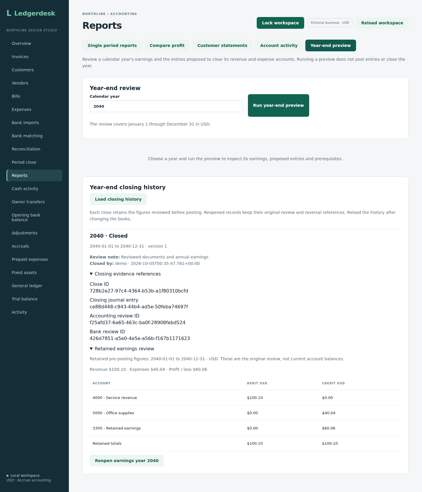
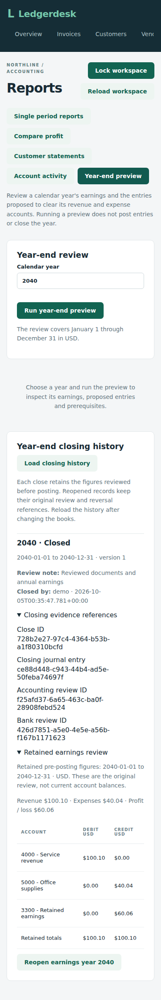
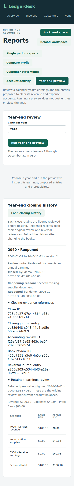

# Posting a calendar-year earnings close

Owners can post the proposal reviewed under **Reports → Year-end preview** and inspect or reopen recorded closes from its history section. The owner API supports the same operations. A posted close clears revenue and expense balances, transfers profit or loss to retained earnings, and retains the figures and supporting review IDs used for the decision.

## Prepare and post

1. Finish due prepaid recognition and depreciation, and review the year's documents and adjustments.
2. Close the bank reconciliation ending December 31 and retain the accounting period close at that date.
3. Run the year-end preview. Resolve every blocker, including revenue/expense balances carried from earlier years.
4. Submit a year and review note using an owner account, a CSRF token and a new request key. The service rechecks the proposal while postings are locked. Reuse that same key and exact body if a connection fails; a successful retry returns the same close ID.

With the backend on port 8080 and your local owner credentials in `LEDGERDESK_USER` and `LEDGERDESK_PASSWORD`, the following posts the reviewed 2026 year. It changes the books; use fictional local records when trying the example. The latest active earnings year can be reopened through the owner API with a current version and reason.

```sh
cookie_file=$(mktemp)
csrf_file=$(mktemp)
curl --fail --silent --show-error --cookie-jar "$cookie_file" \
  'http://localhost:8080/api/csrf' > "$csrf_file"
csrf_header=$(python3 -c 'import json,sys; print(json.load(open(sys.argv[1]))["headerName"])' "$csrf_file")
csrf_token=$(python3 -c 'import json,sys; print(json.load(open(sys.argv[1]))["token"])' "$csrf_file")
curl --fail --silent --show-error --cookie "$cookie_file" \
  --user "$LEDGERDESK_USER:$LEDGERDESK_PASSWORD" \
  --header "$csrf_header: $csrf_token" \
  --header 'Idempotency-Key: year-end-2026-reviewed' \
  --header 'Content-Type: application/json' \
  --data '{"year":2026,"reviewNote":"Reviewed annual earnings and closing proposal"}' \
  'http://localhost:8080/api/year-end'
rm -f "$cookie_file" "$csrf_file"
```

The note must be nonblank and at most 240 characters; the request key must be nonblank and at most 100. Years 1 through 9999 are supported. A changed body with an existing key is rejected, and a different key cannot close a year with an active close again. After reopening, a fresh key creates a new retained close. Missing prerequisites, invalid details and denied writes leave no close or partial journal.

## Inspect retained history

```sh
curl --fail --silent --show-error --user "$LEDGERDESK_USER:$LEDGERDESK_PASSWORD" \
  'http://localhost:8080/api/year-end'
```

The response's `yearEndCloses` array is newest year first and contains the close ID, year/dates, entry ID, supporting accounting and bank IDs, review note, original preview snapshot, actor and timestamp. Database-style field names such as `calendar_year` and `entry_id` are used here. `snapshot` is a JSON string containing the original proposal. Reading roles can inspect history and preview; only owners can post. History and preview use `Cache-Control: no-store`.

Running preview again for a closed year returns that retained proposal with an already-closed blocker and `ready: false`. The proposal's balances describe the review before posting; current account activity and trial balance show the posted offsets. This avoids presenting the zeroed accounts as a new close proposal.

## What happens to the reports

The $100.10 revenue and $40.04 office supplies example creates one December 31 journal: debit revenue $100.10, credit supplies expense $40.04, and credit retained earnings $60.06. The journal's source ID is the retained close ID. Both temporary accounts finish at zero. Permanent asset/liability accounts, owner contributions and drawings stay separate.

Profit and loss and two-period comparisons exclude only journal entries explicitly referenced by retained earnings-close records. They still show $60.06 operating profit after closing. Trial balance, balance sheet and account activity include the real entry: accumulated unclosed earnings becomes zero and posted retained earnings increases, with total equity unchanged. Reports ending before the closing date retain their earlier balances.

A loss debits retained earnings. Equal revenue and expenses still need their two offsets even with zero net profit. An entirely inactive year retains a reviewed close with a null entry ID rather than inventing zero journal lines. The next year's temporary-account opening balances are cleared, and successive closes accumulate in retained earnings.

## Controls and current limits

The business posting lock serializes closing and competing writes. The proposal, journal, retained history, request key and audit event commit in one transaction. An audit or database failure rolls them all back. A database uniqueness constraint prevents two active closes for the same business/year. Reopened records remain in history.

The closing journal is a controlled exception to the already reviewed period's posting cutoff. Ordinary backdated entries remain blocked. A supporting accounting period cannot be reopened while its earnings close is active, so its bank reconciliation remains protected too. Year-end reopening reverses the actual closing lines while preserving operating reports and original review history, as described below.

This remains a local, single-business USD application with calendar-year earnings closing. Custom fiscal years, dividend closing, tax filing, complete opening trial-balance migration are not implemented. The [populated recovery fixture](year-end-restoration.md) checks a close/reopen/replacement cycle after separate H2 and PostgreSQL restores. Broader loss, empty-year and multi-year restoration scenarios remain.

`YearEndPostingTest` covers the worked profit, loss/zero/empty cases, report preservation, retained evidence, consecutive years, exact retries, duplicates, protected dates, rollback, concurrent requests and authenticated read/owner-write permissions on both databases. The [preview guide](year-end.md) provides the accounting basis and reviewed screen captures.

Source `db63b034eb6e40ff62e6cad739502f109926af2f` passed 306 integration tests on each of H2 and PostgreSQL 17 with zero failures/errors/skips, 14 backup-tool tests, production build, all 27 existing Chromium workflows and native PostgreSQL restoration in [run 37241260982](https://github.com/Arhaam-Azhari/ledgerdesk/actions/runs/37241260982). The browser checks are regression evidence; the new posting behavior is exercised through the service and authenticated HTTP tests.


## Reopen, correct and close again

Read `GET /api/year-end` and use the latest record with `status: "CLOSED"`, its `id` and `version`. Only the latest active earnings year can be reopened. First reopen any accounting period reviews ending after that year; a later active earnings close must be handled before an earlier one.

With the same owner authentication, session cookie and CSRF header used for posting, send a fresh request key and:

```http
POST /api/year-end/{closeId}/reopen
Content-Type: application/json
Idempotency-Key: year-end-2026-reopen-review

{"version":1,"reason":"Review missed supplier document"}
```

A current version and nonblank reason of at most 240 characters are required. A changed version or reason with an existing key is rejected. An exact retry returns the original close ID, even if a replacement close has since been posted; it does not reopen that replacement. Reload history to act on a newer record.

Reopening creates a balanced reversal on the original December 31 date, referencing the retained close ID. It exchanges the actual closing journal's debit/credit sides, restores temporary balances and reverses the retained-earnings transfer. A close without a journal also reopens without inventing zero lines. The original snapshot, journal, actor, date and note remain intact. History records `status: "REOPENED"`, the incremented version, `reversal_entry_id`, reason, actor and timestamp. Both closing and reversal entries stay visible in account activity and are excluded from operating profit and comparisons.

The supporting accounting and bank reviews stay closed. To correct the year, reopen the accounting period and then the bank reconciliation through their existing workflows, in latest-first order. Ordinary backdated postings remain blocked until those reviews are reopened. Enter the correction, review and close the bank/accounting period again, run a fresh earnings preview, and post with a new close key. The replacement close gets a new ID and snapshot; the earlier close remains available for inspection.

For the worked $60.06 profit, reopening restores $100.10 credit revenue, $40.04 debit supplies expense and zero retained earnings from that close. Adding an unpaid $10.10 invoice after reopening the supporting reviews produces $70.16 profit at reclose. The integration fixture repeats the close/reopen cycle and verifies that only one close is active while earlier snapshots are unchanged.

The migration retains populated closing rows and replaces the original one-record-per-year uniqueness rule with one active close per year. The active-year key is cleared on reopening. Reversal, history, request key and audit changes remain one transaction under the business posting lock; failed or competing requests cannot leave a partial or duplicate reversal.


Reopening source `c5468e410570bc2f9b64ae259f6d84bca029765c` passed 315 integration tests on each of H2 and PostgreSQL 17 with zero failures/errors/skips, 14 backup-tool tests, production build, all 27 existing Chromium workflows and native PostgreSQL restoration in [run 37246856587](https://github.com/Arhaam-Azhari/ledgerdesk/actions/runs/37246856587). Eight reopening tests and one populated-migration test exercise the new behavior on both databases. These checks verify reversing profit/loss/empty closes, preserved full reports and comparisons, retained snapshots, ordered later-year/period controls, corrections and repeated closes, exact retries, invalid versions/reasons, rollback, concurrency, owner-only writes and preservation of existing V24 closing rows. Browser checks remain regression evidence; the later browser controls milestone adds end-to-end UI evidence; populated year-end recovery fixtures remain later work.


## Post, inspect and reopen in Reports

Owners can run **Reports → Year-end preview**, resolve the blockers and inspect the proposed lines. Enter a **Year-end review note**, click **Close year-end earnings**, and confirm the year. The button is disabled until prerequisites pass and the note is nonblank. A successful operation refreshes the workspace and clears the old proposal.

Click **Load closing history** to inspect recorded cycles. Each record shows its year, dates, status, version, review note, closing identity/time and any reopening reason/identity/time. Expand **Closing evidence references** for the close, journal, accounting review, bank review and reversal IDs. Expand **Retained earnings review** for the original accrual figures and balanced proposed lines. These are the saved pre-posting figures, not today's account balances.

Only the latest active close offers **Reopen earnings year** to owners. Enter a **Year-end reopening reason** and confirm. Later accounting reviews must be reopened first; a server rejection retains your reason so you can resolve the blocker and retry. Successful reopening refreshes the workspace and clears old history. Load it again to inspect the retained reversal. Its supporting accounting and bank reviews remain closed until separately reopened.

If posting or reopening loses its response, keep the same note/reason and retry. The form retains those details, and the shared request handler keeps the same key until both the operation and workspace refresh succeed. A successful reclose creates a new record; earlier reopened cycles remain in history. Changing the year clears the proposal and review note. A workspace reload clears proposal/history and any selected reopening. Leaving this report resets its local forms.

Bookkeepers and reviewers can run previews and inspect retained history without posting or reopening controls. Busy state disables inputs, confirmations and report modes. Failed history reads clear old history and show the error; **Load closing history** retries the read. There is no separate year-end export yet.


## Browser proof

Controls source `efe17823c9dd86d3889eb2aa815e4f25afe2e041` passed 315 integration tests on each of H2 and PostgreSQL 17 with zero failures/errors/skips, 14 backup-tool tests, production build, all 28 Chromium workflows and native PostgreSQL restoration in [run 37247930933](https://github.com/Arhaam-Azhari/ledgerdesk/actions/runs/37247930933).

The new isolated controls fixture uses a December 31, 2039 bank opening, a $100.10 unpaid invoice and a $40.04 unpaid bill during 2040, and real December 31 bank/accounting closes. It posts $60.06 earnings, inspects the retained proposal and references, reopens with a reason, and closes again with one active and one retained reopened record. The dates are fictional accounting dates; the closing timestamps show when the test actually ran.

The browser deliberately receives a 503 after the server has successfully posted a close, then retries with the same note and request key. It repeats that loss-after-commit check for reopening. Both recoveries retain one close/reversal and preserve the original snapshot. The workflow also checks missing prerequisites, blank-note/reason gating, confirmation cancellation, history read failure/retry, clearing after workspace refresh, 390-pixel layout, and unchanged $60.06 operating profit and balanced reports after reclose. Reviewer and bookkeeper fixtures load history and verify that write controls are absent; their history fixture is empty, while the owner fixture exercises populated history.

Original desktop/mobile captures were downloaded and visually reviewed. The preview captures in the [review guide](year-end.md) were replaced with this run's current controls. The following show distinct recorded and reopened states:







This controls run does not populate year-end records in its general restore fixture. The later [earnings recovery scenario](year-end-restoration.md) adds dedicated H2 and PostgreSQL checks.
