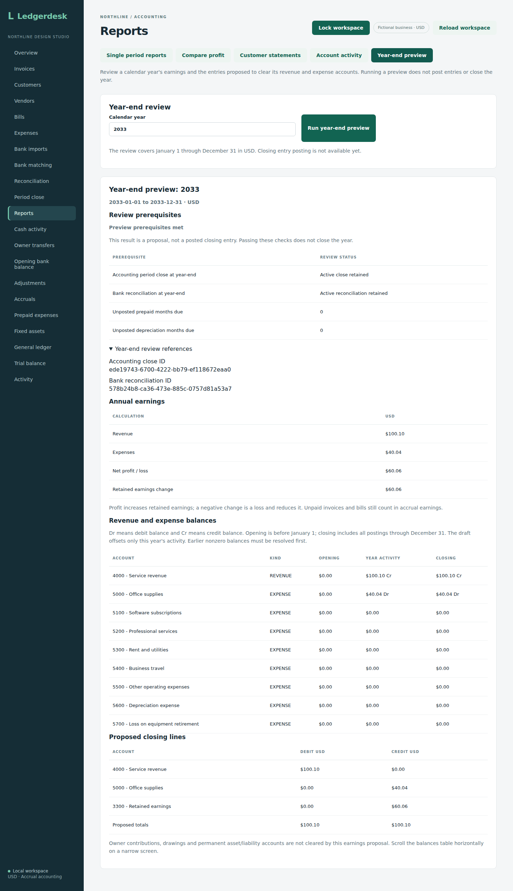
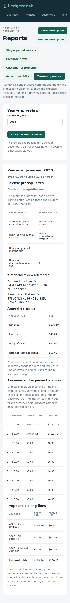

# Calendar-year earnings preview

This API prepares a read-only review of the revenue and expense balances for January 1 through December 31. It shows the offsets that would clear that year's activity and transfer net profit or loss to retained earnings account 3300. It does not post a closing entry. The browser screen supports the same read-only review. Posting/history and preservation of profit reports after posting are later work.

## Run a preview

With the backend running and your local account credentials, request:

```sh
curl --user "$LEDGERDESK_USER:$LEDGERDESK_PASSWORD" \
  'http://localhost:8080/api/year-end/preview?year=2026'
```

Owner, bookkeeper and reviewer accounts can read this endpoint. Requests require authentication, responses use `Cache-Control: no-store`, and missing, nonnumeric or out-of-range years return 400. Calendar years 1 through 9999 are supported. Dates, account balances, annual profit, proposed debit/credit lines, prerequisite record IDs and readable blockers are returned together. Amounts are exact decimal strings in USD.

## Worked figures

The integration fixture starts with a cleared $1,000.25 bank opening on December 31, 2025. During 2026 it posts an unpaid $100.10 invoice and an unpaid $40.04 supplies bill. Accrual profit is $60.06 even though neither document is settled. The draft is:

| Account | Debit | Credit |
| --- | ---: | ---: |
| 4000 Service revenue | 100.10 | 0.00 |
| 5000 Office supplies | 0.00 | 40.04 |
| 3300 Retained earnings | 0.00 | 60.06 |
| Total | 100.10 | 100.10 |

A loss produces a debit to retained earnings. Zero accounts create no proposed line, and zero profit creates no retained-earnings line. Contra revenue/expense balances preserve their actual sides. Owner contributions, drawings, bank, receivables and payables are not cleared by this earnings preview.

Temporary-account opening, period and closing balances use signed debit minus credit, the same convention as account activity. `retainedEarningsChange` instead expresses an increase in equity as positive: profit is positive and loss negative. The proposed lines use separate nonnegative debit/credit amounts.

## Prerequisites and limits

`ready` means the preview's checks passed; there is still no posting operation. The selected year-end needs an active accounting period close and active bank reconciliation ending on December 31. Reopened records do not qualify. Due prepaid and depreciation months through that date must be posted or appropriately ended, and the trial balance, balance sheet and proposed lines must balance.

Any revenue or expense account with a nonzero balance before January 1 blocks readiness. Checking each account matters: an earlier year's equal revenue and expenses still need closing even when its net profit was zero. The draft displays only the selected year's offsets, so it must not be used to clear those older balances. Future postings and other businesses' ledger entries are excluded. The application still serves business 1 with a shared chart of accounts; this check does not introduce multi-business access.

The calculation runs in a repeatable-read transaction and reuses the period-review schedule checks. It inserts no journal, command, close or audit record. The migration adds retained earnings to the chart with no opening posting. Calendar-year earnings review does not cover custom fiscal years, tax calculations, dividend closing or a complete opening trial-balance migration.

## Evidence

`YearEndTest` exercises the actual services and authenticated HTTP endpoint on H2 and PostgreSQL. It checks the worked draft against real bank and accounting closes, unchanged ledger/audit/request-key records, loss and contra sides, zero activity, older individual balances, outstanding scheduled months, unbalanced books, future and foreign entries, calendar limits and all reading roles. At the PR #33 API checkpoint, existing browser workflows provided regression evidence. The later screen milestone adds a dedicated browser workflow and screenshots.

The accounting basis is the treatment of revenue and expenses as temporary accounts and retained earnings as permanent equity described in [OpenStax, closing entries](https://openstax.org/books/principles-financial-accounting/pages/5-1-describe-and-prepare-closing-entries-for-a-business). This draft combines the offsets and net earnings transfer into one balanced proposal rather than exposing an intermediate income-summary account. The project demonstrates accrual reporting, sign-correct ledger offsets, prerequisite controls, historical cutoffs and transactional read consistency.

Source `fe1b246cf0086bc533d4921f36946dcc9a3ba5bb` passed 298 integration tests on each database, 14 backup-tool tests, the production build, all 26 existing Chromium workflows and native PostgreSQL restoration in [run 37238292917](https://github.com/Arhaam-Azhari/ledgerdesk/actions/runs/37238292917).


## Review in the browser

Open **Reports → Year-end preview**, enter a whole calendar year between 1 and 9999, and click **Run year-end preview**. The result shows the annual accrual revenue/expenses and net profit or loss, the corresponding retained-earnings change, and each temporary account's opening, year activity and closing. Dr/Cr presentation preserves credit and unusual account balances.

Read **Review prerequisites** before using the proposal. Missing/reopened December 31 reviews and unfinished scheduled adjustments appear alongside earlier earnings balances and any accounting differences. Active close IDs can be inspected under **Year-end review references**. **Preview prerequisites met** means these checks passed; it does not mean a closing entry was posted. There is no posting button.

The proposed debit/credit lines and totals appear below the balances. A year without activity has no proposed lines; it can still have blockers from earlier years. Profit increases retained earnings, while a negative change indicates a loss. Owner transfers and permanent account balances are retained separately.

Changing the year, reloading the workspace or leaving this report clears the result. During a request, year and mode controls are disabled. A failed request clears the old proposal and displays an error; run it again after resolving the failure. This is an on-screen review; a dedicated year-end export is not implemented.

The balances table scrolls horizontally on a narrow screen; the rest of the review fits the viewport. Owner, bookkeeper and reviewer accounts can run this screen.


## Screen proof

Screen source `c2a994c6fe68f4c7ae325496411229ff1c37ba21` passed all three jobs in [run 37239595097](https://github.com/Arhaam-Azhari/ledgerdesk/actions/runs/37239595097): 298 integration tests on each of H2 and PostgreSQL 17 with zero failures/errors/skips, 14 backup-tool tests, production build, all 27 Chromium workflows and native PostgreSQL restoration.

The isolated browser fixture uses a fresh H2 process with a December 31, 2032 opening and the same $100.10 invoice, $40.04 unpaid bill and $60.06 profit as the API example, shifted to 2033. It first shows the missing review blockers, then creates real bank and accounting closes and checks their IDs and balanced proposed lines. Later 2034 loss and 2036 revenue postings do not alter the earlier 2033 preview. The 2034 loss debits retained earnings by $10.10 but remains blocked by earlier temporary balances. The empty 2035 year also retains those blockers.

The test checks invalid whole-year inputs, failed-read retry, disabled controls while loading, clearing after year/reload/mode changes and an unchanged complete workspace after reading. Reviewer and bookkeeper scenarios also run the preview. Original captures from the successful workflow were downloaded and visually reviewed; the mobile balances table was actually scrolled right to show closing amounts. No entries are posted by the preview.




